# Preview Environment Architecture

## Table of Contents
1. [Overview](#overview)
2. [Core Concepts](#core-concepts)
3. [Architecture](#architecture)
4. [Backend Implementation](#backend-implementation)
5. [Frontend Implementation](#frontend-implementation)
6. [Data Flow](#data-flow)
7. [Integration Points](#integration-points)
8. [Configuration](#configuration)
9. [Best Practices](#best-practices)
10. [Troubleshooting](#troubleshooting)

## Overview

### Purpose
The Preview Environment system provides live preview capabilities for web applications, enabling AI agents and developers to see real-time results of code changes. It orchestrates development servers, injects debugging capabilities, and provides a bridge between code modifications and visual feedback through sophisticated process management and real-time communication.

### Key Responsibilities
- Orchestrate development server lifecycle with intelligent process management
- Provide live preview with hot reload and automatic recovery
- Capture and stream console output with structured formatting
- Enable DOM inspection through injected debugging capabilities
- Detect and adapt to different web frameworks automatically
- Manage dynamic port allocation with conflict resolution
- Stream server logs in real-time via Server-Sent Events
- Recover orphaned processes after system crashes

### Position in Architecture
Preview environments serve as the visual feedback layer in the AI-driven development workflow. They transform code changes into running applications, providing both AI agents and developers with immediate validation of modifications. This system bridges the workspace execution environment with the user interface, making abstract code changes tangible and verifiable.

## Core Concepts

### Domain Terminology

| Term | Definition |
|------|------------|
| Preview Server | Development server instance running user's application |
| Inspector Script | Client-side JavaScript providing debugging and monitoring capabilities |
| Port Allocation | Dynamic assignment strategy for available network ports |
| Script Injection | Technique for adding inspector capabilities to preview applications |
| Server Handler | Process lifecycle manager for development servers |
| Console Capture | Real-time interception and streaming of console output |
| DOM Inspector | Interactive element selection and property inspection system |
| Framework Detector | Automatic identification of web framework and configuration |
| Process Recovery | Mechanism to restore servers after system crashes |
| Message Bridge | PostMessage-based communication between iframe and parent |
| Log Streamer | Real-time log forwarding via Server-Sent Events |

### Key Abstractions

The Preview Environment system operates through several layers of abstraction that ensure reliability and flexibility:

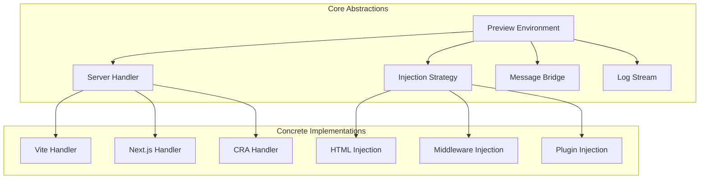
```mermaid
graph TD
    subgraph "Core Abstractions"
        PE[Preview Environment]
        SH[Server Handler]
        IS[Injection Strategy]
        MB[Message Bridge]
        LS[Log Stream]
    end
    
    subgraph "Concrete Implementations"
        VH[Vite Handler]
        NH[Next.js Handler]
        CH[CRA Handler]
        HI[HTML Injection]
        MI[Middleware Injection]
        PI[Plugin Injection]
    end
    
    PE --> SH
    PE --> IS
    PE --> MB
    PE --> LS
    
    SH --> VH
    SH --> NH
    SH --> CH
    
    IS --> HI
    IS --> MI
    IS --> PI
```

### Design Decisions

#### Process Management Strategy
- **Isolated process per preview** ensures clean separation and prevents conflicts
- **Graceful shutdown with timeout** allows servers to clean up resources properly
- **Automatic port recycling** prevents port exhaustion in long-running sessions
- **Process group management** ensures child processes are cleaned up

#### Communication Architecture
- **PostMessage API** provides secure cross-origin communication
- **Structured message protocol** ensures reliable parsing and routing
- **Event namespacing** prevents conflicts with application code
- **Bidirectional communication** enables inspector control from parent

#### Resilience Patterns
- **Metadata persistence** enables recovery after crashes
- **Health check polling** detects server failures quickly
- **Automatic restart** recovers from transient failures
- **Orphan process detection** cleans up abandoned servers

## Architecture

### High-Level Overview

The Preview Environment system orchestrates live application previews through a sophisticated multi-layered architecture that manages server processes, injects debugging capabilities, and provides real-time communication channels.

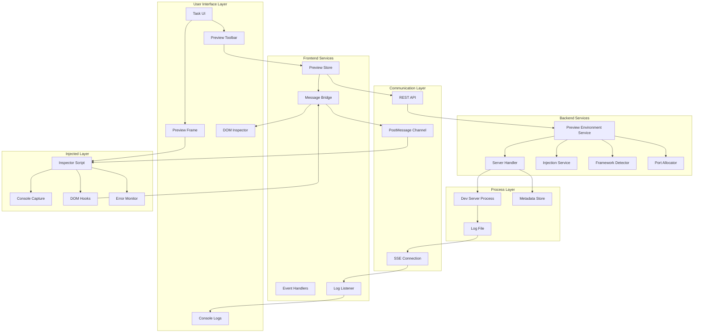
```mermaid
graph TB
    subgraph "User Interface Layer"
        UI[Task UI]
        PT[Preview Toolbar]
        PF[Preview Frame]
        CL[Console Logs]
        DI[DOM Inspector]
    end
    
    subgraph "Frontend Services"
        PS[Preview Store]
        MB[Message Bridge]
        EH[Event Handlers]
        LL[Log Listener]
    end
    
    subgraph "Communication Layer"
        PM[PostMessage Channel]
        SSE[SSE Connection]
        API[REST API]
    end
    
    subgraph "Backend Services"
        PES[Preview Environment Service]
        SH[Server Handler]
        IS[Injection Service]
        FD[Framework Detector]
        PA[Port Allocator]
    end
    
    subgraph "Process Layer"
        DS[Dev Server Process]
        LF[Log File]
        MD[Metadata Store]
    end
    
    subgraph "Injected Layer"
        INS[Inspector Script]
        CC[Console Capture]
        DH[DOM Hooks]
        EM[Error Monitor]
    end
    
    UI --> PT
    PT --> PS
    PS --> MB
    MB --> PM
    PM --> INS
    
    UI --> PF
    PF --> INS
    INS --> CC
    INS --> DH
    INS --> EM
    
    PS --> API
    API --> PES
    PES --> SH
    PES --> IS
    PES --> FD
    PES --> PA
    
    SH --> DS
    DS --> LF
    SH --> MD
    
    LF --> SSE
    SSE --> LL
    LL --> CL
    
    DH --> MB
    MB --> DI
```

### Architectural Layers

#### 1. User Interface Layer
The visual components that users interact with directly:
- **Preview Frame**: Isolated iframe containing the running application
- **Preview Toolbar**: Controls for refresh, inspect, and server management
- **Console Logs**: Real-time display of application console output
- **DOM Inspector**: Interactive element selection and property viewer

#### 2. Frontend Services Layer
State management and coordination logic:
- **Preview Store**: Centralized state for preview status and configuration
- **Message Bridge**: Handles PostMessage communication with iframe
- **Event Handlers**: Process incoming messages from inspector script
- **Log Listener**: Consumes server log SSE stream

#### 3. Communication Layer
Bridges frontend and backend through multiple channels:
- **PostMessage Channel**: Secure iframe communication
- **SSE Connection**: Real-time server log streaming
- **REST API**: Server lifecycle management

#### 4. Backend Services Layer
Core business logic and process management:
- **Preview Environment Service**: Orchestrates all preview operations
- **Server Handler**: Manages individual server processes
- **Injection Service**: Modifies application to add inspector
- **Framework Detector**: Identifies web framework and configuration
- **Port Allocator**: Manages dynamic port assignment

#### 5. Process Layer
Low-level system resources:
- **Dev Server Process**: Actual running development server
- **Log File**: Persistent server output storage
- **Metadata Store**: Process recovery information

#### 6. Injected Layer
Client-side debugging capabilities:
- **Inspector Script**: Core debugging runtime
- **Console Capture**: Intercepts and forwards console calls
- **DOM Hooks**: Enables element selection and inspection
- **Error Monitor**: Catches and reports runtime errors

### Component Interaction Patterns

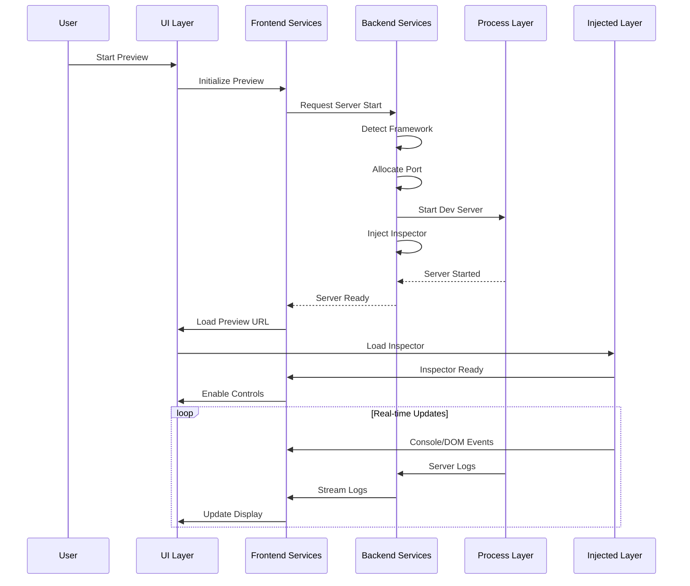
```mermaid
sequenceDiagram
    participant U as User
    participant UI as UI Layer
    participant FS as Frontend Services
    participant BE as Backend Services
    participant P as Process Layer
    participant I as Injected Layer
    
    U->>UI: Start Preview
    UI->>FS: Initialize Preview
    FS->>BE: Request Server Start
    BE->>BE: Detect Framework
    BE->>BE: Allocate Port
    BE->>P: Start Dev Server
    BE->>BE: Inject Inspector
    P-->>BE: Server Started
    BE-->>FS: Server Ready
    FS->>UI: Load Preview URL
    UI->>I: Load Inspector
    I->>FS: Inspector Ready
    FS->>UI: Enable Controls
    
    loop Real-time Updates
        I->>FS: Console/DOM Events
        P->>BE: Server Logs
        BE->>FS: Stream Logs
        FS->>UI: Update Display
    end
```

## Backend Implementation

### Service Layer Architecture

The backend implementation follows a layered architecture that separates concerns and ensures maintainability:

```mermaid
graph LR
    subgraph "API Layer"
        R1[/start Route]
        R2[/stop Route]
        R3[/status Route]
        R4[/logs Route]
    end
    
    subgraph "Service Layer"
        PES[Preview Environment Service]
        subgraph "Handlers"
            VH[Vite Handler]
            NH[Next Handler]
            CH[CRA Handler]
        end
    end
    
    subgraph "Infrastructure"
        PM[Process Manager]
        PA[Port Allocator]
        LM[Log Manager]
        MS[Metadata Store]
    end
    
    subgraph "External"
        FS[File System]
        NET[Network]
        PROC[OS Process]
    end
    
    R1 --> PES
    R2 --> PES
    R3 --> PES
    R4 --> PES
    
    PES --> VH
    PES --> NH
    PES --> CH
    
    VH --> PM
    NH --> PM
    CH --> PM
    
    PM --> PA
    PM --> LM
    PM --> MS
    
    PA --> NET
    LM --> FS
    MS --> FS
    PM --> PROC
```

### Server Lifecycle Management

The server lifecycle is carefully orchestrated to ensure reliable operation:

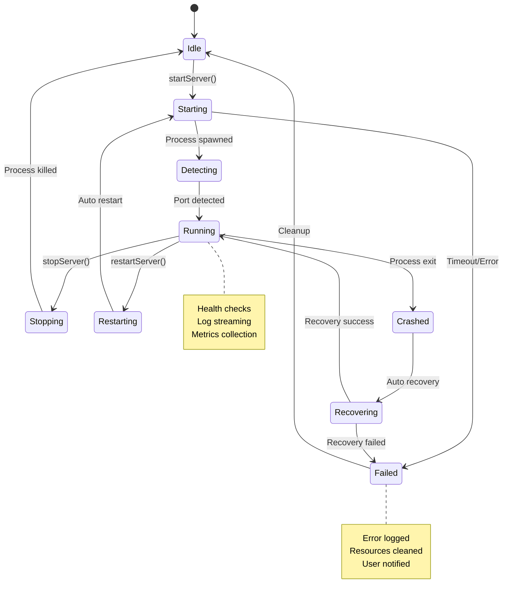
```mermaid
stateDiagram-v2
    [*] --> Idle
    Idle --> Starting: startServer()
    Starting --> Detecting: Process spawned
    Detecting --> Running: Port detected
    Starting --> Failed: Timeout/Error
    Failed --> Idle: Cleanup
    
    Running --> Stopping: stopServer()
    Running --> Restarting: restartServer()
    Running --> Crashed: Process exit
    
    Stopping --> Idle: Process killed
    Restarting --> Starting: Auto restart
    Crashed --> Recovering: Auto recovery
    Recovering --> Running: Recovery success
    Recovering --> Failed: Recovery failed
    
    note right of Running
        Health checks
        Log streaming
        Metrics collection
    end note
    
    note right of Failed
        Error logged
        Resources cleaned
        User notified
    end note
```

### Port Allocation Strategy

Dynamic port allocation prevents conflicts and ensures scalability:

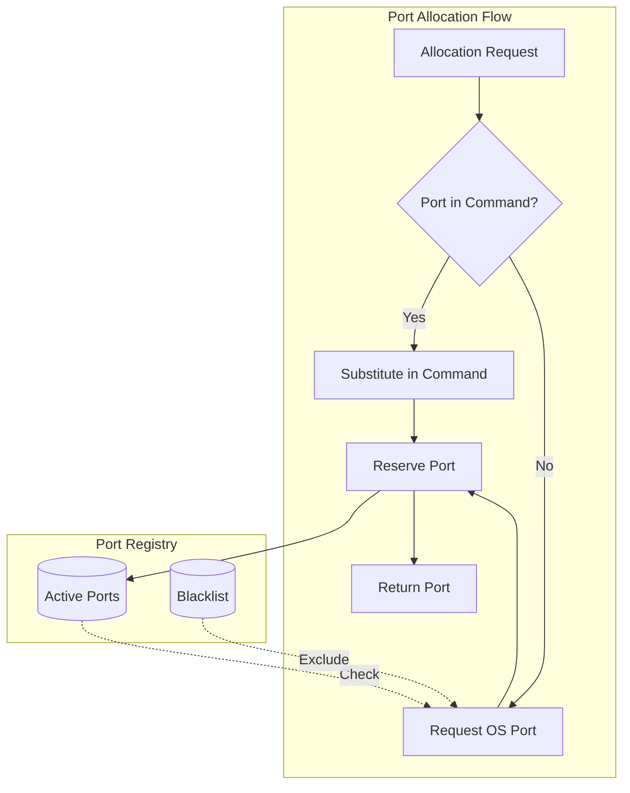
```mermaid
graph TD
    subgraph "Port Allocation Flow"
        REQ[Allocation Request]
        CHK{Port in Command?}
        DYN[Request OS Port]
        SUB[Substitute in Command]
        RES[Reserve Port]
        RET[Return Port]
    end
    
    subgraph "Port Registry"
        REG[(Active Ports)]
        BL[(Blacklist)]
    end
    
    REQ --> CHK
    CHK -->|Yes| SUB
    CHK -->|No| DYN
    DYN --> RES
    SUB --> RES
    RES --> REG
    RES --> RET
    
    REG -.->|Check| DYN
    BL -.->|Exclude| DYN
```

### Process Recovery Mechanism

The system can recover from crashes and restore preview environments:

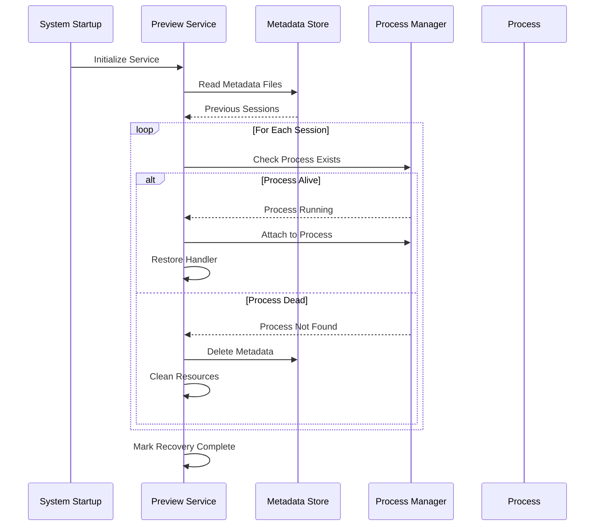
```mermaid
sequenceDiagram
    participant S as System Startup
    participant PES as Preview Service
    participant MS as Metadata Store
    participant PM as Process Manager
    participant P as Process
    
    S->>PES: Initialize Service
    PES->>MS: Read Metadata Files
    MS-->>PES: Previous Sessions
    
    loop For Each Session
        PES->>PM: Check Process Exists
        alt Process Alive
            PM-->>PES: Process Running
            PES->>PM: Attach to Process
            PES->>PES: Restore Handler
        else Process Dead
            PM-->>PES: Process Not Found
            PES->>MS: Delete Metadata
            PES->>PES: Clean Resources
        end
    end
    
    PES->>PES: Mark Recovery Complete
```

### Script Injection System

The injection system adapts to different frameworks and build tools to ensure inspector capabilities are available:

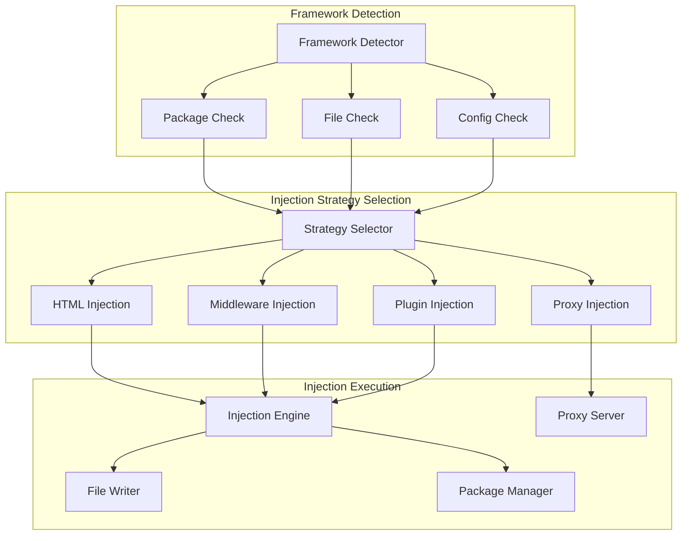
```mermaid
graph TD
    subgraph "Framework Detection"
        FD[Framework Detector]
        PC[Package Check]
        FC[File Check]
        CC[Config Check]
    end
    
    subgraph "Injection Strategy Selection"
        SS[Strategy Selector]
        HI[HTML Injection]
        MI[Middleware Injection]
        PI[Plugin Injection]
        PR[Proxy Injection]
    end
    
    subgraph "Injection Execution"
        IE[Injection Engine]
        FW[File Writer]
        PM[Package Manager]
        PS[Proxy Server]
    end
    
    FD --> PC
    FD --> FC
    FD --> CC
    
    PC --> SS
    FC --> SS
    CC --> SS
    
    SS --> HI
    SS --> MI
    SS --> PI
    SS --> PR
    
    HI --> IE
    MI --> IE
    PI --> IE
    PR --> PS
    
    IE --> FW
    IE --> PM
```

#### Injection Strategy by Framework

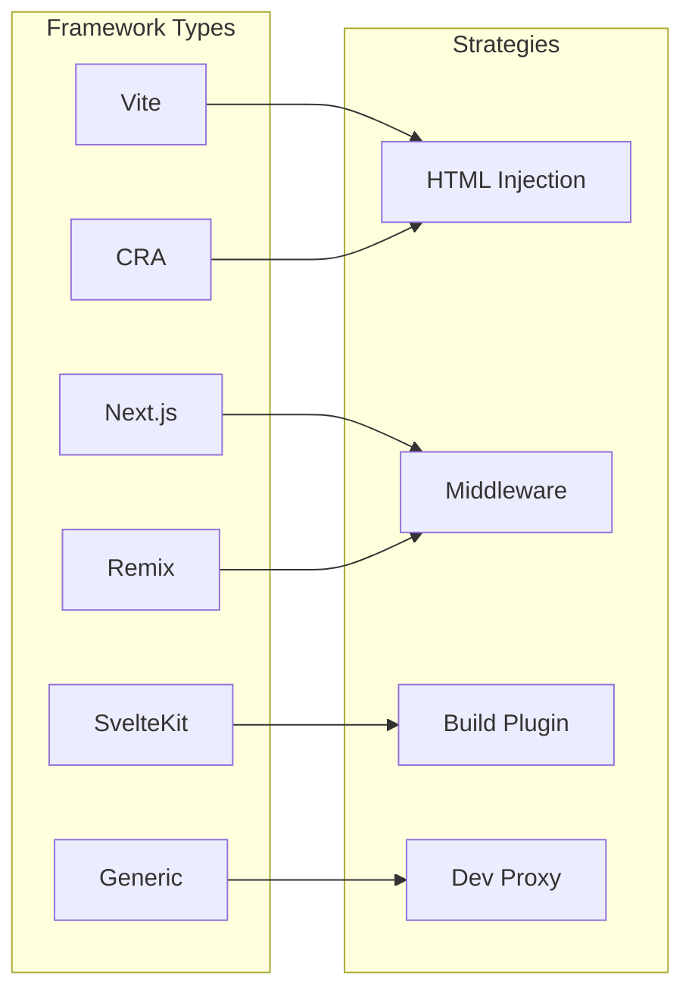
```mermaid
graph LR
    subgraph "Framework Types"
        V[Vite]
        N[Next.js]
        C[CRA]
        R[Remix]
        S[SvelteKit]
        G[Generic]
    end
    
    subgraph "Strategies"
        HTML[HTML Injection]
        MW[Middleware]
        PLG[Build Plugin]
        PXY[Dev Proxy]
    end
    
    V --> HTML
    N --> MW
    C --> HTML
    R --> MW
    S --> PLG
    G --> PXY
```

### Inspector Script Architecture

The inspector script provides debugging capabilities through a modular architecture:

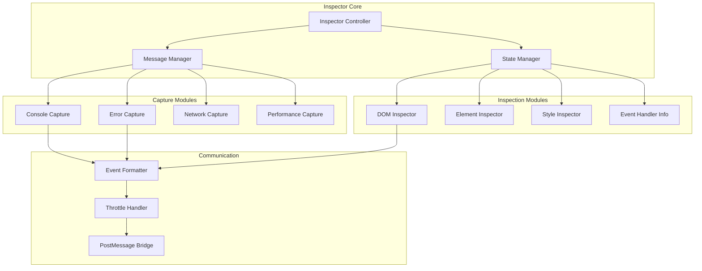
```mermaid
graph TD
    subgraph "Inspector Core"
        IC[Inspector Controller]
        MM[Message Manager]
        SM[State Manager]
    end
    
    subgraph "Capture Modules"
        CC[Console Capture]
        EC[Error Capture]
        NC[Network Capture]
        PC[Performance Capture]
    end
    
    subgraph "Inspection Modules"
        DI[DOM Inspector]
        EI[Element Inspector]
        SI[Style Inspector]
        EH[Event Handler Info]
    end
    
    subgraph "Communication"
        PM[PostMessage Bridge]
        EF[Event Formatter]
        TH[Throttle Handler]
    end
    
    IC --> MM
    IC --> SM
    
    MM --> CC
    MM --> EC
    MM --> NC
    MM --> PC
    
    SM --> DI
    SM --> EI
    SM --> SI
    SM --> EH
    
    CC --> EF
    EC --> EF
    DI --> EF
    
    EF --> TH
    TH --> PM
```

### API Layer

The API layer provides RESTful endpoints for preview environment management:

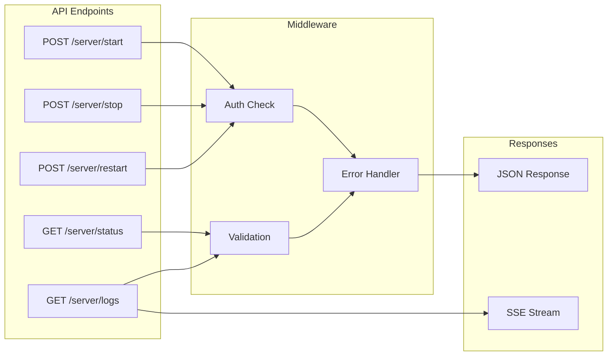
```mermaid
graph LR
    subgraph "API Endpoints"
        START[POST /server/start]
        STOP[POST /server/stop]
        RESTART[POST /server/restart]
        STATUS[GET /server/status]
        LOGS[GET /server/logs]
    end
    
    subgraph "Middleware"
        AUTH[Auth Check]
        VALID[Validation]
        ERROR[Error Handler]
    end
    
    subgraph "Responses"
        JSON[JSON Response]
        SSE[SSE Stream]
    end
    
    START --> AUTH
    STOP --> AUTH
    RESTART --> AUTH
    STATUS --> VALID
    LOGS --> VALID
    
    AUTH --> ERROR
    VALID --> ERROR
    
    ERROR --> JSON
    LOGS --> SSE
```

### Business Logic Flows

#### Server Start Flow

The server start process involves multiple coordinated steps:

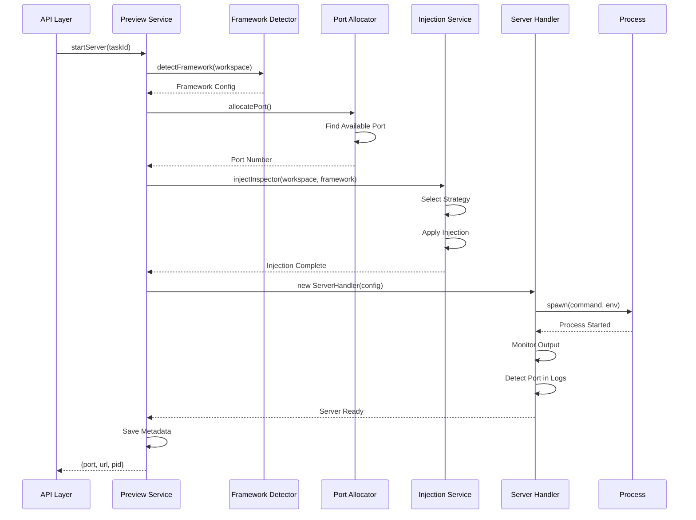
```mermaid
sequenceDiagram
    participant API as API Layer
    participant PES as Preview Service
    participant FD as Framework Detector
    participant PA as Port Allocator
    participant IS as Injection Service
    participant SH as Server Handler
    participant P as Process
    
    API->>PES: startServer(taskId)
    PES->>FD: detectFramework(workspace)
    FD-->>PES: Framework Config
    
    PES->>PA: allocatePort()
    PA->>PA: Find Available Port
    PA-->>PES: Port Number
    
    PES->>IS: injectInspector(workspace, framework)
    IS->>IS: Select Strategy
    IS->>IS: Apply Injection
    IS-->>PES: Injection Complete
    
    PES->>SH: new ServerHandler(config)
    SH->>P: spawn(command, env)
    P-->>SH: Process Started
    
    SH->>SH: Monitor Output
    SH->>SH: Detect Port in Logs
    SH-->>PES: Server Ready
    
    PES->>PES: Save Metadata
    PES-->>API: {port, url, pid}
```

#### Framework Detection Logic

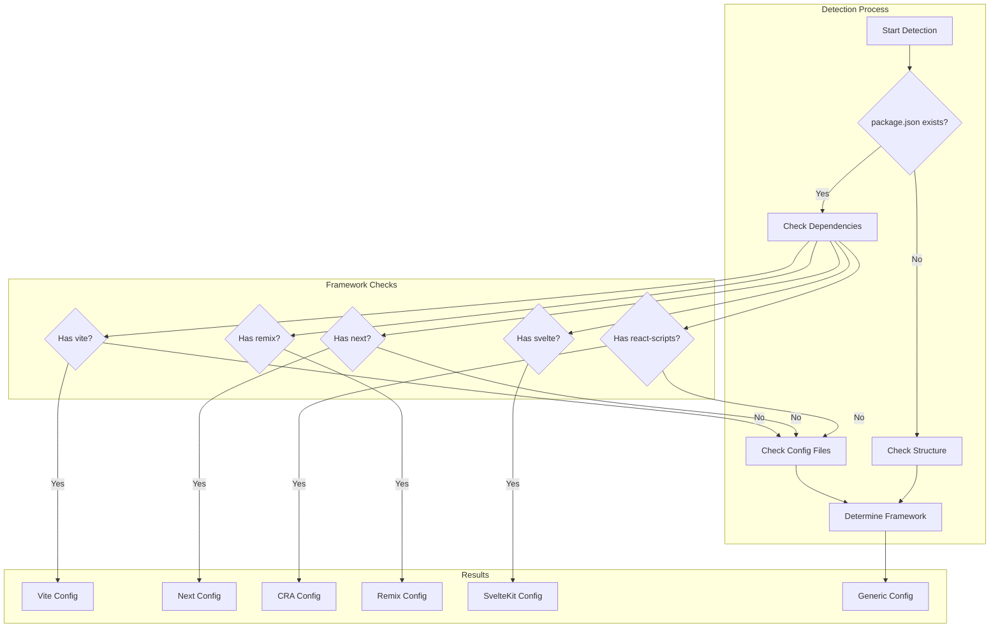
```mermaid
graph TD
    subgraph "Detection Process"
        START[Start Detection]
        PJ{package.json exists?}
        DEPS[Check Dependencies]
        CONF[Check Config Files]
        STRUCT[Check Structure]
        DET[Determine Framework]
    end
    
    subgraph "Framework Checks"
        VITE{Has vite?}
        NEXT{Has next?}
        CRA{Has react-scripts?}
        REMIX{Has remix?}
        SVELTE{Has svelte?}
    end
    
    subgraph "Results"
        VR[Vite Config]
        NR[Next Config]
        CR[CRA Config]
        RR[Remix Config]
        SR[SvelteKit Config]
        GR[Generic Config]
    end
    
    START --> PJ
    PJ -->|Yes| DEPS
    PJ -->|No| STRUCT
    
    DEPS --> VITE
    DEPS --> NEXT
    DEPS --> CRA
    DEPS --> REMIX
    DEPS --> SVELTE
    
    VITE -->|Yes| VR
    NEXT -->|Yes| NR
    CRA -->|Yes| CR
    REMIX -->|Yes| RR
    SVELTE -->|Yes| SR
    
    VITE -->|No| CONF
    NEXT -->|No| CONF
    CRA -->|No| CONF
    
    CONF --> DET
    STRUCT --> DET
    DET --> GR
```

## Frontend Implementation

### Component Architecture

The frontend implementation follows a modular architecture that separates UI components, state management, and communication logic:

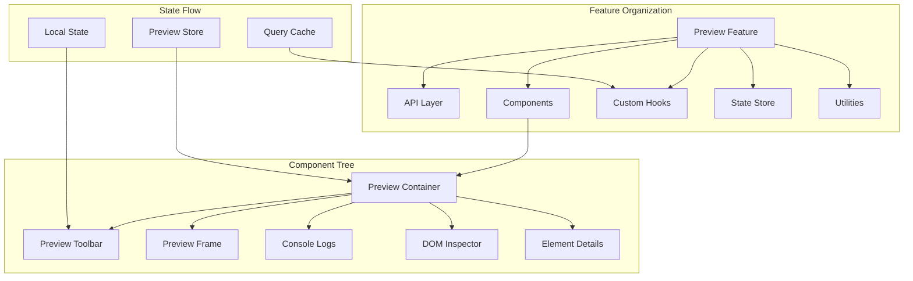
```mermaid
graph TD
    subgraph "Feature Organization"
        PREV[Preview Feature]
        API[API Layer]
        COMP[Components]
        HOOKS[Custom Hooks]
        STORE[State Store]
        UTILS[Utilities]
    end
    
    subgraph "Component Tree"
        PC[Preview Container]
        PT[Preview Toolbar]
        PF[Preview Frame]
        CL[Console Logs]
        DI[DOM Inspector]
        ED[Element Details]
    end
    
    subgraph "State Flow"
        PS[Preview Store]
        LS[Local State]
        QC[Query Cache]
    end
    
    PREV --> API
    PREV --> COMP
    PREV --> HOOKS
    PREV --> STORE
    PREV --> UTILS
    
    COMP --> PC
    PC --> PT
    PC --> PF
    PC --> CL
    PC --> DI
    PC --> ED
    
    PS --> PC
    LS --> PT
    QC --> HOOKS
```

### State Management Architecture

The preview system uses a hybrid state management approach:

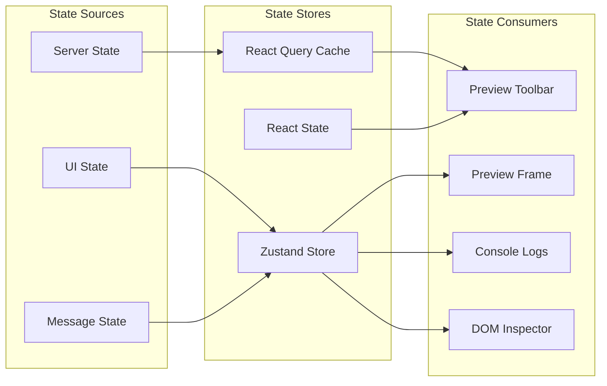
```mermaid
graph LR
    subgraph "State Sources"
        SS[Server State]
        US[UI State]
        MS[Message State]
    end
    
    subgraph "State Stores"
        QC[React Query Cache]
        ZS[Zustand Store]
        RS[React State]
    end
    
    subgraph "State Consumers"
        PT[Preview Toolbar]
        PF[Preview Frame]
        CL[Console Logs]
        DI[DOM Inspector]
    end
    
    SS --> QC
    US --> ZS
    MS --> ZS
    
    QC --> PT
    ZS --> PF
    ZS --> CL
    ZS --> DI
    RS --> PT
```

### Message Communication Flow

The message system enables bidirectional communication between the parent window and preview iframe:

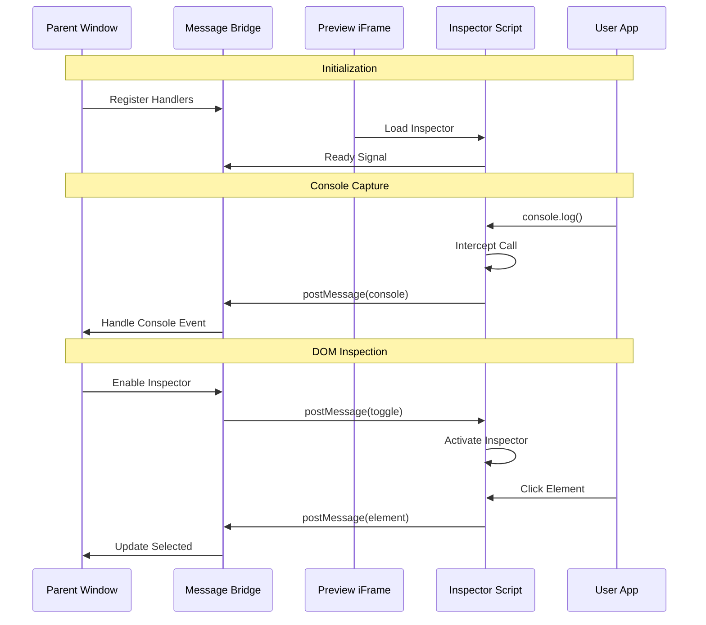
```mermaid
sequenceDiagram
    participant PW as Parent Window
    participant MB as Message Bridge
    participant IF as Preview iFrame
    participant IS as Inspector Script
    participant APP as User App
    
    Note over PW,APP: Initialization
    PW->>MB: Register Handlers
    IF->>IS: Load Inspector
    IS->>MB: Ready Signal
    
    Note over PW,APP: Console Capture
    APP->>IS: console.log()
    IS->>IS: Intercept Call
    IS->>MB: postMessage(console)
    MB->>PW: Handle Console Event
    
    Note over PW,APP: DOM Inspection
    PW->>MB: Enable Inspector
    MB->>IS: postMessage(toggle)
    IS->>IS: Activate Inspector
    APP->>IS: Click Element
    IS->>MB: postMessage(element)
    MB->>PW: Update Selected
```

### Real-time Updates Architecture

The system provides multiple real-time update channels:

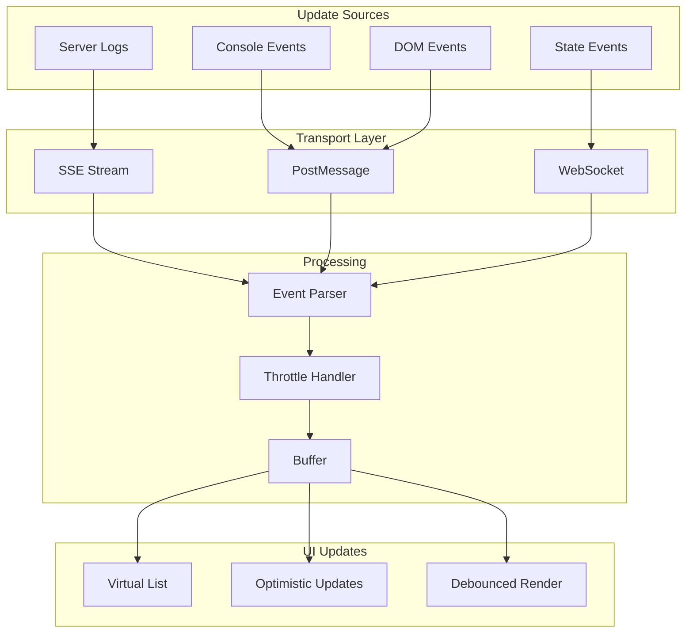
```mermaid
graph TD
    subgraph "Update Sources"
        SL[Server Logs]
        CE[Console Events]
        DE[DOM Events]
        SE[State Events]
    end
    
    subgraph "Transport Layer"
        SSE[SSE Stream]
        PM[PostMessage]
        WS[WebSocket]
    end
    
    subgraph "Processing"
        EP[Event Parser]
        TH[Throttle Handler]
        BF[Buffer]
    end
    
    subgraph "UI Updates"
        VL[Virtual List]
        OU[Optimistic Updates]
        DB[Debounced Render]
    end
    
    SL --> SSE
    CE --> PM
    DE --> PM
    SE --> WS
    
    SSE --> EP
    PM --> EP
    WS --> EP
    
    EP --> TH
    TH --> BF
    
    BF --> VL
    BF --> OU
    BF --> DB
```

## Data Flow

### End-to-End Preview Lifecycle

The complete preview lifecycle involves coordination across multiple system layers:

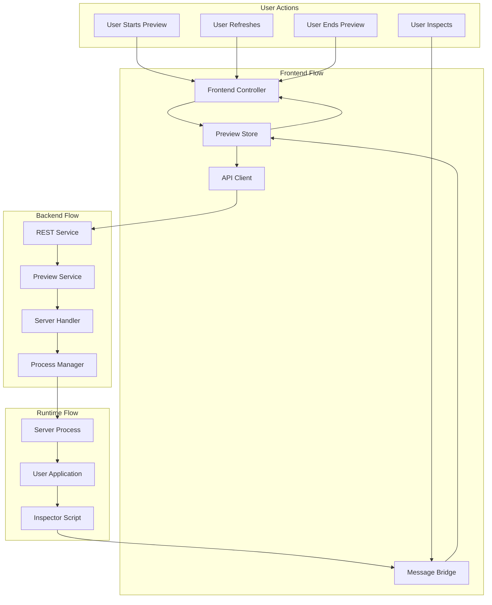
```mermaid
graph TB
    subgraph "User Actions"
        US[User Starts Preview]
        UI[User Inspects]
        UR[User Refreshes]
        UE[User Ends Preview]
    end
    
    subgraph "Frontend Flow"
        FC[Frontend Controller]
        PS[Preview Store]
        API[API Client]
        MB[Message Bridge]
    end
    
    subgraph "Backend Flow"
        RS[REST Service]
        PES[Preview Service]
        SH[Server Handler]
        PM[Process Manager]
    end
    
    subgraph "Runtime Flow"
        SP[Server Process]
        IS[Inspector Script]
        UA[User Application]
    end
    
    US --> FC
    FC --> PS
    PS --> API
    API --> RS
    RS --> PES
    PES --> SH
    SH --> PM
    PM --> SP
    
    SP --> UA
    UA --> IS
    IS --> MB
    MB --> PS
    PS --> FC
    
    UI --> MB
    UR --> FC
    UE --> FC
```

### Concurrent Operations Management

The system handles multiple concurrent operations gracefully:

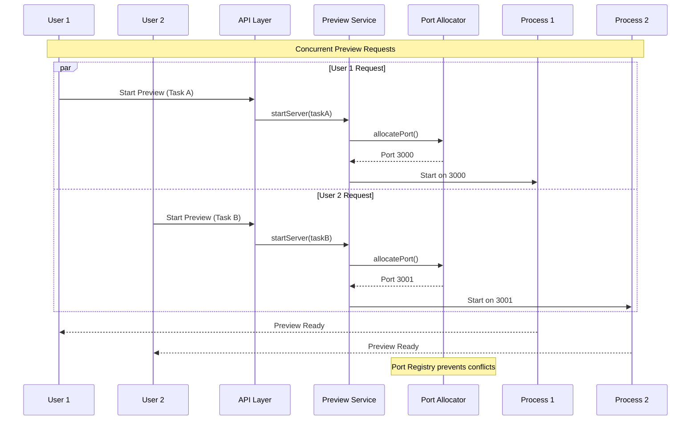
```mermaid
sequenceDiagram
    participant U1 as User 1
    participant U2 as User 2
    participant API as API Layer
    participant PES as Preview Service
    participant PA as Port Allocator
    participant P1 as Process 1
    participant P2 as Process 2
    
    Note over U1,P2: Concurrent Preview Requests
    
    par User 1 Request
        U1->>API: Start Preview (Task A)
        API->>PES: startServer(taskA)
        PES->>PA: allocatePort()
        PA-->>PES: Port 3000
        PES->>P1: Start on 3000
    and User 2 Request
        U2->>API: Start Preview (Task B)
        API->>PES: startServer(taskB)
        PES->>PA: allocatePort()
        PA-->>PES: Port 3001
        PES->>P2: Start on 3001
    end
    
    P1-->>U1: Preview Ready
    P2-->>U2: Preview Ready
    
    Note over PA: Port Registry prevents conflicts
```

### Error Recovery Flow

The system includes comprehensive error recovery mechanisms:

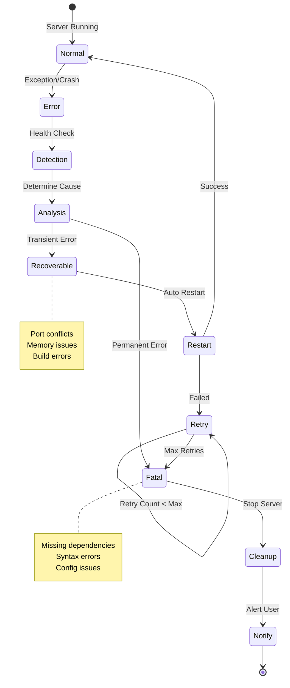
```mermaid
stateDiagram-v2
    [*] --> Normal: Server Running
    
    Normal --> Error: Exception/Crash
    Error --> Detection: Health Check
    
    Detection --> Analysis: Determine Cause
    
    Analysis --> Recoverable: Transient Error
    Analysis --> Fatal: Permanent Error
    
    Recoverable --> Restart: Auto Restart
    Restart --> Normal: Success
    Restart --> Retry: Failed
    
    Retry --> Retry: Retry Count < Max
    Retry --> Fatal: Max Retries
    
    Fatal --> Cleanup: Stop Server
    Cleanup --> Notify: Alert User
    Notify --> [*]
    
    note right of Recoverable
        Port conflicts
        Memory issues
        Build errors
    end note
    
    note right of Fatal
        Missing dependencies
        Syntax errors
        Config issues
    end note
```

## Integration Points

### System Integration Architecture

The Preview Environment system integrates with multiple components across the architecture:

```mermaid
graph TB
    subgraph "Preview System"
        PES[Preview Environment Service]
        SH[Server Handler]
        IS[Injection Service]
    end
    
    subgraph "Core Services"
        TS[Task Service]
        WS[Workspace Service]
        RS[Repository Service]
        ES[Event Service]
    end
    
    subgraph "Infrastructure"
        FS[File System]
        NET[Network Layer]
        PROC[Process Manager]
        LOG[Logging System]
    end
    
    subgraph "External Systems"
        NPM[NPM Registry]
        GIT[Git Repository]
        DOCKER[Docker Engine]
    end
    
    PES --> TS
    PES --> WS
    PES --> RS
    PES --> ES
    
    SH --> FS
    SH --> NET
    SH --> PROC
    SH --> LOG
    
    IS --> NPM
    WS --> GIT
    RS --> DOCKER
```

### Event Integration Pattern

The system participates in the event-driven architecture through well-defined event contracts:

```mermaid
sequenceDiagram
    participant PS as Preview Service
    participant ES as Event Service
    participant TS as Task Service
    participant UI as UI Components
    
    Note over PS,UI: Server Lifecycle Events
    
    PS->>ES: emit('preview.server.starting')
    ES->>UI: Broadcast Event
    
    PS->>ES: emit('preview.server.started')
    ES->>UI: Broadcast Event
    ES->>TS: Update Task Status
    
    PS->>ES: emit('preview.server.error')
    ES->>UI: Broadcast Event
    ES->>TS: Mark Task Error
    
    Note over PS,UI: Consuming Events
    
    TS->>ES: emit('task.deleted')
    ES->>PS: Handle Event
    PS->>PS: Stop Preview Server
    
    TS->>ES: emit('workspace.reset')
    ES->>PS: Handle Event
    PS->>PS: Restart Preview Server
```

### Data Contract Architecture

The system defines clear data contracts for integration:

```mermaid
graph LR
    subgraph "Input Contracts"
        TC[Task Config]
        WC[Workspace Config]
        RC[Repository Config]
    end
    
    subgraph "Preview System"
        PES[Preview Service]
        VAL[Validator]
        TRANS[Transformer]
    end
    
    subgraph "Output Contracts"
        SS[Server Status]
        CE[Console Events]
        EI[Element Info]
        ERR[Error Details]
    end
    
    TC --> VAL
    WC --> VAL
    RC --> VAL
    
    VAL --> PES
    PES --> TRANS
    
    TRANS --> SS
    TRANS --> CE
    TRANS --> EI
    TRANS --> ERR
```

## Configuration

### Configuration Architecture

The Preview Environment system uses a layered configuration approach:

```mermaid
graph TD
    subgraph "Configuration Sources"
        ENV[Environment Variables]
        CONF[Config Files]
        REPO[Repository Settings]
        RUNTIME[Runtime Detection]
    end
    
    subgraph "Configuration Layers"
        DEFAULT[Default Config]
        FRAMEWORK[Framework Config]
        PROJECT[Project Config]
        USER[User Overrides]
    end
    
    subgraph "Configuration Resolution"
        MERGER[Config Merger]
        VALIDATOR[Config Validator]
        RESOLVER[Config Resolver]
    end
    
    ENV --> DEFAULT
    CONF --> FRAMEWORK
    REPO --> PROJECT
    RUNTIME --> USER
    
    DEFAULT --> MERGER
    FRAMEWORK --> MERGER
    PROJECT --> MERGER
    USER --> MERGER
    
    MERGER --> VALIDATOR
    VALIDATOR --> RESOLVER
```

### Framework Auto-Configuration

The system automatically configures itself based on detected frameworks:

```mermaid
graph LR
    subgraph "Detection"
        DET[Framework Detector]
        PKG[package.json]
        FILES[Config Files]
        STRUCT[File Structure]
    end
    
    subgraph "Framework Profiles"
        VITE[Vite Profile]
        NEXT[Next.js Profile]
        CRA[CRA Profile]
        REMIX[Remix Profile]
        CUSTOM[Custom Profile]
    end
    
    subgraph "Configuration Output"
        PORT[Port Strategy]
        INJ[Injection Method]
        CMD[Start Command]
        DETECT[Detection Pattern]
    end
    
    DET --> PKG
    DET --> FILES
    DET --> STRUCT
    
    PKG --> VITE
    PKG --> NEXT
    PKG --> CRA
    PKG --> REMIX
    FILES --> CUSTOM
    
    VITE --> PORT
    VITE --> INJ
    VITE --> CMD
    VITE --> DETECT
```

### Runtime Configuration Flow

Configuration can be modified at runtime through multiple mechanisms:

```mermaid
sequenceDiagram
    participant U as User
    participant API as API Layer
    participant CS as Config Service
    participant PS as Preview Service
    participant SH as Server Handler
    
    U->>API: Start with Config
    API->>CS: Merge Configurations
    CS->>CS: Validate Config
    CS-->>API: Final Config
    
    API->>PS: Start Server(config)
    PS->>PS: Apply Framework Defaults
    PS->>PS: Apply User Overrides
    PS->>SH: Create Handler(config)
    
    SH->>SH: Configure Process
    SH->>SH: Set Environment
    SH->>SH: Apply Injection
    SH-->>PS: Server Ready
```

## Best Practices

### Architectural Guidelines

#### Process Management
- **Isolate each preview process** to prevent interference between tasks
- **Implement health monitoring** with configurable thresholds
- **Use process groups** to ensure child processes are cleaned up
- **Save process metadata** immediately after spawn for recovery
- **Implement exponential backoff** for restart attempts

#### Communication Security
- **Validate message origins** in all PostMessage handlers
- **Use structured message formats** with versioning
- **Implement message throttling** to prevent flooding
- **Sanitize all data** before rendering in UI
- **Use CSP headers** to restrict iframe capabilities

#### Performance Optimization
```mermaid
graph TD
    subgraph "Performance Strategies"
        LAZY[Lazy Loading]
        CACHE[Caching]
        THROTTLE[Throttling]
        VIRTUAL[Virtualization]
    end
    
    subgraph "Implementation"
        IFRAME[Preview iFrame]
        DETECT[Framework Detection]
        CONSOLE[Console Logs]
        LOGS[Server Logs]
    end
    
    LAZY --> IFRAME
    CACHE --> DETECT
    THROTTLE --> CONSOLE
    VIRTUAL --> LOGS
```

#### Resilience Patterns
- **Implement circuit breakers** for failing servers
- **Use bulkheads** to isolate failures
- **Add timeouts** at every async boundary
- **Log all errors** with contextual information
- **Provide fallback behaviors** for all features

### Anti-Patterns to Avoid

```mermaid
graph LR
    subgraph "Don't Do This"
        HARD[Hardcoded Ports]
        TRUST[Trust All Messages]
        LEAK[Resource Leaks]
        SYNC[Synchronous Operations]
    end
    
    subgraph "Do This Instead"
        DYN[Dynamic Allocation]
        VAL[Validate Origins]
        CLEAN[Cleanup Handlers]
        ASYNC[Async Everything]
    end
    
    HARD -.->|Replace| DYN
    TRUST -.->|Replace| VAL
    LEAK -.->|Replace| CLEAN
    SYNC -.->|Replace| ASYNC
```

## Troubleshooting

### Diagnostic Architecture

The system provides comprehensive diagnostic capabilities:

```mermaid
graph TD
    subgraph "Diagnostic Sources"
        LOGS[Server Logs]
        METRICS[Performance Metrics]
        EVENTS[System Events]
        HEALTH[Health Checks]
    end
    
    subgraph "Diagnostic Tools"
        ANALYZER[Log Analyzer]
        PROFILER[Performance Profiler]
        DEBUGGER[Debug Interface]
        MONITOR[Health Monitor]
    end
    
    subgraph "Diagnostic Output"
        REPORT[Diagnostic Report]
        ALERTS[System Alerts]
        TRACES[Stack Traces]
        RECOM[Recommendations]
    end
    
    LOGS --> ANALYZER
    METRICS --> PROFILER
    EVENTS --> DEBUGGER
    HEALTH --> MONITOR
    
    ANALYZER --> REPORT
    PROFILER --> TRACES
    DEBUGGER --> ALERTS
    MONITOR --> RECOM
```

### Common Failure Patterns

```mermaid
stateDiagram-v2
    [*] --> PortConflict: Port In Use
    [*] --> DependencyError: Missing Deps
    [*] --> InjectionFailure: Script Blocked
    [*] --> ProcessCrash: Server Crash
    
    PortConflict --> Resolution1: Dynamic Port Allocation
    DependencyError --> Resolution2: Auto Install Dependencies
    InjectionFailure --> Resolution3: Fallback Strategy
    ProcessCrash --> Resolution4: Process Recovery
    
    Resolution1 --> [*]: Resolved
    Resolution2 --> [*]: Resolved
    Resolution3 --> [*]: Resolved
    Resolution4 --> [*]: Resolved
    
    note right of PortConflict
        Detection: EADDRINUSE
        Solution: Retry with new port
    end note
    
    note right of DependencyError
        Detection: Module not found
        Solution: Run package manager
    end note
    
    note right of InjectionFailure
        Detection: CSP violation
        Solution: Use proxy method
    end note
    
    note right of ProcessCrash
        Detection: Exit code != 0
        Solution: Restart with backoff
    end note
```

### Debug Workflow

```mermaid
sequenceDiagram
    participant D as Developer
    participant DT as Debug Tools
    participant PS as Preview System
    participant LOG as Log System
    participant MET as Metrics System
    
    D->>DT: Enable Debug Mode
    DT->>PS: Set Debug Flags
    PS->>LOG: Verbose Logging
    PS->>MET: Detailed Metrics
    
    Note over D,MET: Issue Reproduction
    
    D->>PS: Trigger Issue
    PS->>LOG: Capture Debug Logs
    PS->>MET: Record Metrics
    
    LOG-->>DT: Debug Output
    MET-->>DT: Performance Data
    
    DT->>DT: Analyze Data
    DT-->>D: Diagnostic Report
```

### Health Monitoring Strategy

```mermaid
graph LR
    subgraph "Health Checks"
        PC[Process Check]
        NC[Network Check]
        RC[Resource Check]
        SC[Script Check]
    end
    
    subgraph "Health Status"
        GREEN[Healthy]
        YELLOW[Degraded]
        RED[Failed]
    end
    
    subgraph "Actions"
        LOG[Log Warning]
        RESTART[Auto Restart]
        ALERT[Send Alert]
        FALLBACK[Use Fallback]
    end
    
    PC --> GREEN
    NC --> YELLOW
    RC --> YELLOW
    SC --> RED
    
    GREEN --> LOG
    YELLOW --> RESTART
    RED --> ALERT
    RED --> FALLBACK
```

## Related Documentation
- [Repository Architecture](./repositories.md)
- [Workspace Architecture](./workspaces.md)
- [Task Management Architecture](./tasks.md)
- [Event Architecture](./events.md)