# Repository Architecture

## Table of Contents
1. [Overview](#overview)
2. [Conceptual Model](#conceptual-model)
3. [Architectural Design](#architectural-design)
4. [Repository Lifecycle](#repository-lifecycle)
5. [Execution Environment Architecture](#execution-environment-architecture)
6. [Integration Architecture](#integration-architecture)
7. [State Management](#state-management)
8. [Framework Detection System](#framework-detection-system)
9. [Configuration Flow](#configuration-flow)
10. [Security Architecture](#security-architecture)

## Overview

### Purpose
Repositories in Moatless Swarm UI represent **execution environments** that define how AI agents interact with codebases. They are not merely git repositories, but complete configurations that enable isolated, concurrent, and safe code modifications through automated task execution.

### Architectural Role
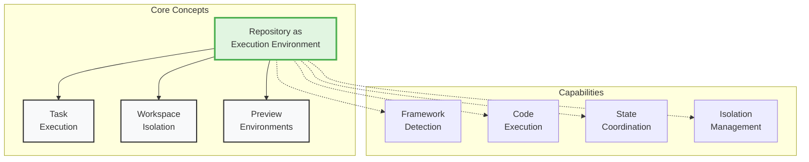
```mermaid
graph TB
    subgraph "Core Concepts"
        R[Repository as<br/>Execution Environment]
        T[Task<br/>Execution]
        W[Workspace<br/>Isolation]
        P[Preview<br/>Environments]
    end
    
    subgraph "Capabilities"
        FD[Framework<br/>Detection]
        CE[Code<br/>Execution]
        SC[State<br/>Coordination]
        IM[Isolation<br/>Management]
    end
    
    R --> T
    R --> W
    R --> P
    
    R -.-> FD
    R -.-> CE
    R -.-> SC
    R -.-> IM
    
    style R fill:#e1f5e1,stroke:#4caf50,stroke-width:3px
    style T fill:#f8f9fa,stroke:#333,stroke-width:2px
    style W fill:#f8f9fa,stroke:#333,stroke-width:2px
    style P fill:#f8f9fa,stroke:#333,stroke-width:2px
```

### Key Responsibilities
- **Define execution contexts** for AI agent operations
- **Provide workspace isolation** through git worktrees
- **Enable preview environments** with framework-aware configuration
- **Coordinate state** across concurrent task executions
- **Manage lifecycle** of code execution environments

## Conceptual Model

### Repository as an Execution Environment
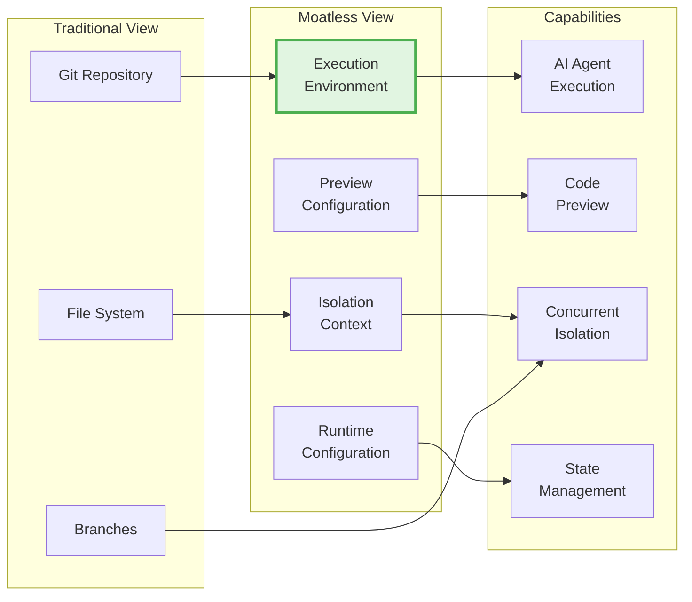
```mermaid
graph LR
    subgraph "Traditional View"
        GR[Git Repository]
        FS[File System]
        BR[Branches]
    end
    
    subgraph "Moatless View"
        EE[Execution<br/>Environment]
        IC[Isolation<br/>Context]
        PC[Preview<br/>Configuration]
        RC[Runtime<br/>Configuration]
    end
    
    subgraph "Capabilities"
        AI[AI Agent<br/>Execution]
        CP[Code<br/>Preview]
        CI[Concurrent<br/>Isolation]
        SM[State<br/>Management]
    end
    
    GR --> EE
    FS --> IC
    BR --> CI
    
    EE --> AI
    PC --> CP
    IC --> CI
    RC --> SM
    
    style EE fill:#e1f5e1,stroke:#4caf50,stroke-width:3px
```

### Core Abstractions
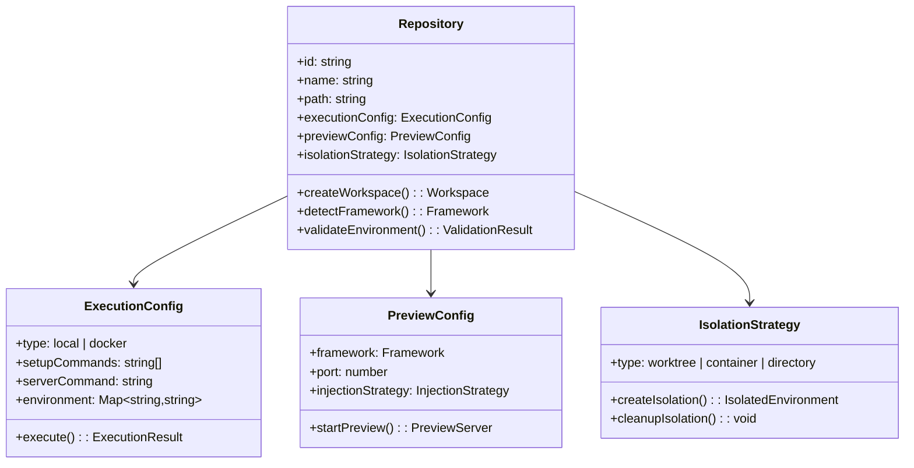
```mermaid
classDiagram
    class Repository {
        +id: string
        +name: string
        +path: string
        +executionConfig: ExecutionConfig
        +previewConfig: PreviewConfig
        +isolationStrategy: IsolationStrategy
        +createWorkspace(): Workspace
        +detectFramework(): Framework
        +validateEnvironment(): ValidationResult
    }
    
    class ExecutionConfig {
        +type: local | docker
        +setupCommands: string[]
        +serverCommand: string
        +environment: Map~string,string~
        +execute(): ExecutionResult
    }
    
    class PreviewConfig {
        +framework: Framework
        +port: number
        +injectionStrategy: InjectionStrategy
        +startPreview(): PreviewServer
    }
    
    class IsolationStrategy {
        +type: worktree | container | directory
        +createIsolation(): IsolatedEnvironment
        +cleanupIsolation(): void
    }
    
    Repository --> ExecutionConfig
    Repository --> PreviewConfig
    Repository --> IsolationStrategy
```

## Architectural Design

### System Architecture
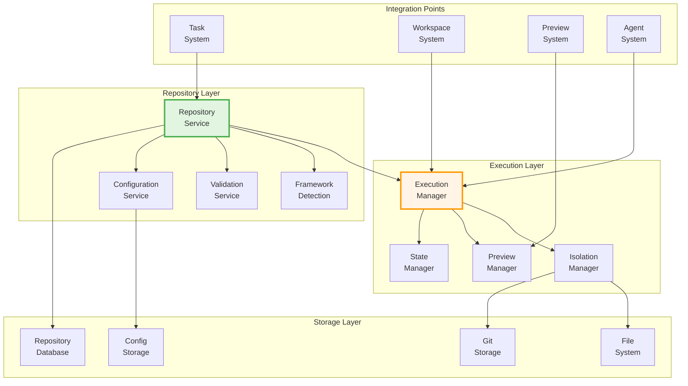
```mermaid
graph TB
    subgraph "Repository Layer"
        RS[Repository<br/>Service]
        FDS[Framework<br/>Detection]
        VS[Validation<br/>Service]
        CS[Configuration<br/>Service]
    end
    
    subgraph "Execution Layer"
        EM[Execution<br/>Manager]
        IM[Isolation<br/>Manager]
        PM[Preview<br/>Manager]
        SM[State<br/>Manager]
    end
    
    subgraph "Storage Layer"
        RDB[Repository<br/>Database]
        FS[File<br/>System]
        GS[Git<br/>Storage]
        CS2[Config<br/>Storage]
    end
    
    subgraph "Integration Points"
        TS[Task<br/>System]
        WS[Workspace<br/>System]
        PS[Preview<br/>System]
        AS[Agent<br/>System]
    end
    
    RS --> EM
    RS --> FDS
    RS --> VS
    RS --> CS
    
    EM --> IM
    EM --> PM
    EM --> SM
    
    RS --> RDB
    IM --> FS
    IM --> GS
    CS --> CS2
    
    TS --> RS
    WS --> EM
    PS --> PM
    AS --> EM
    
    style RS fill:#e1f5e1,stroke:#4caf50,stroke-width:3px
    style EM fill:#fff4e6,stroke:#ff9800,stroke-width:3px
```

### Component Interactions
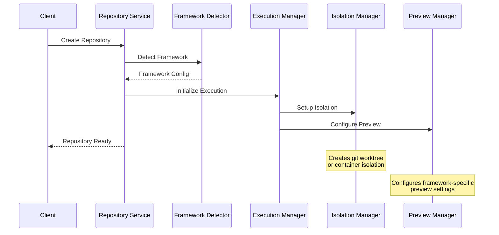
```mermaid
sequenceDiagram
    participant C as Client
    participant RS as Repository Service
    participant FD as Framework Detector
    participant EM as Execution Manager
    participant IM as Isolation Manager
    participant PM as Preview Manager
    
    C->>RS: Create Repository
    RS->>FD: Detect Framework
    FD-->>RS: Framework Config
    RS->>EM: Initialize Execution
    EM->>IM: Setup Isolation
    EM->>PM: Configure Preview
    RS-->>C: Repository Ready
    
    Note over IM: Creates git worktree<br/>or container isolation
    Note over PM: Configures framework-specific<br/>preview settings
```

## Repository Lifecycle

### State Transitions
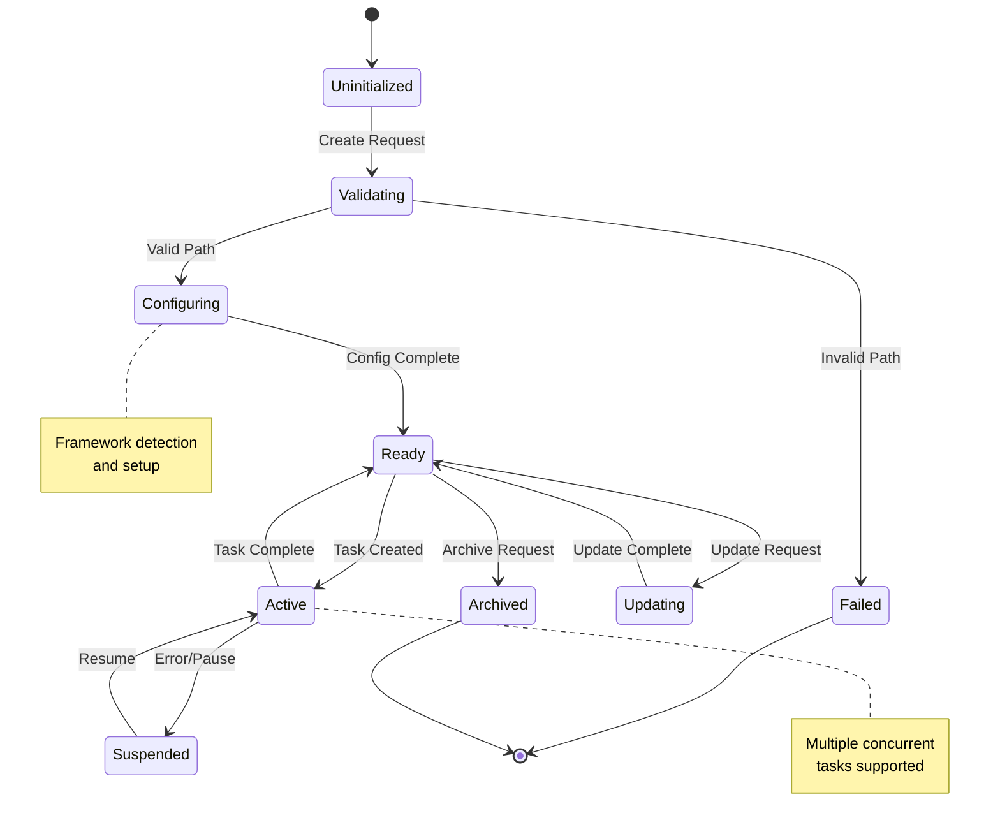
```mermaid
stateDiagram-v2
    [*] --> Uninitialized
    Uninitialized --> Validating: Create Request
    Validating --> Configuring: Valid Path
    Validating --> Failed: Invalid Path
    Configuring --> Ready: Config Complete
    Ready --> Active: Task Created
    Active --> Ready: Task Complete
    Ready --> Updating: Update Request
    Updating --> Ready: Update Complete
    Ready --> Archived: Archive Request
    Active --> Suspended: Error/Pause
    Suspended --> Active: Resume
    Failed --> [*]
    Archived --> [*]
    
    note right of Active: Multiple concurrent<br/>tasks supported
    note right of Configuring: Framework detection<br/>and setup
```

### Lifecycle Management Flow
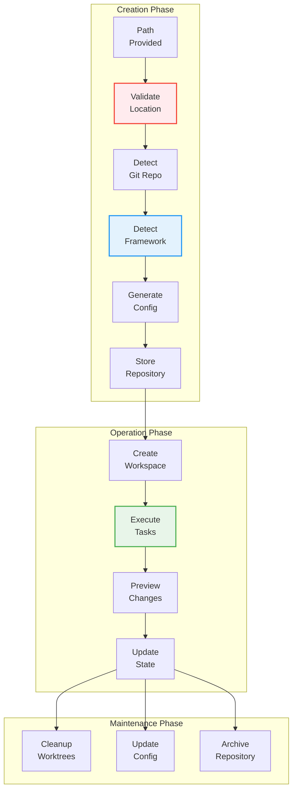
```mermaid
graph TB
    subgraph "Creation Phase"
        CP[Path<br/>Provided] --> VL[Validate<br/>Location]
        VL --> DG[Detect<br/>Git Repo]
        DG --> DF[Detect<br/>Framework]
        DF --> GC[Generate<br/>Config]
        GC --> ST[Store<br/>Repository]
    end
    
    subgraph "Operation Phase"
        ST --> CR[Create<br/>Workspace]
        CR --> EX[Execute<br/>Tasks]
        EX --> PR[Preview<br/>Changes]
        PR --> UP[Update<br/>State]
    end
    
    subgraph "Maintenance Phase"
        UP --> CL[Cleanup<br/>Worktrees]
        UP --> UC[Update<br/>Config]
        UP --> AR[Archive<br/>Repository]
    end
    
    style VL fill:#ffebee,stroke:#f44336,stroke-width:2px
    style DF fill:#e3f2fd,stroke:#2196f3,stroke-width:2px
    style EX fill:#e8f5e9,stroke:#4caf50,stroke-width:2px
```

## Execution Environment Architecture

### Environment Layers
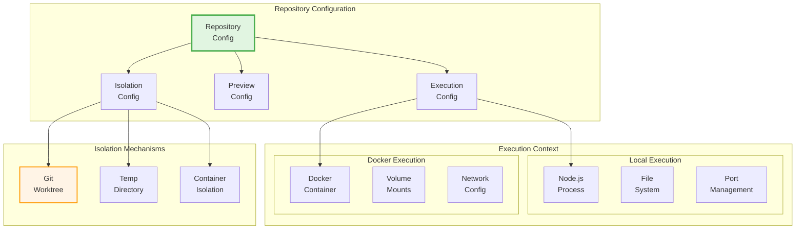
```mermaid
graph TB
    subgraph "Repository Configuration"
        RC[Repository<br/>Config]
        EC[Execution<br/>Config]
        PC[Preview<br/>Config]
        IC[Isolation<br/>Config]
    end
    
    subgraph "Execution Context"
        subgraph "Local Execution"
            LE[Node.js<br/>Process]
            LF[File<br/>System]
            LP[Port<br/>Management]
        end
        
        subgraph "Docker Execution"
            DC[Docker<br/>Container]
            DV[Volume<br/>Mounts]
            DN[Network<br/>Config]
        end
    end
    
    subgraph "Isolation Mechanisms"
        GW[Git<br/>Worktree]
        TM[Temp<br/>Directory]
        CT[Container<br/>Isolation]
    end
    
    RC --> EC
    RC --> PC
    RC --> IC
    
    EC --> LE
    EC --> DC
    
    IC --> GW
    IC --> TM
    IC --> CT
    
    style RC fill:#e1f5e1,stroke:#4caf50,stroke-width:3px
    style GW fill:#fff4e6,stroke:#ff9800,stroke-width:2px
```

### Execution Flow
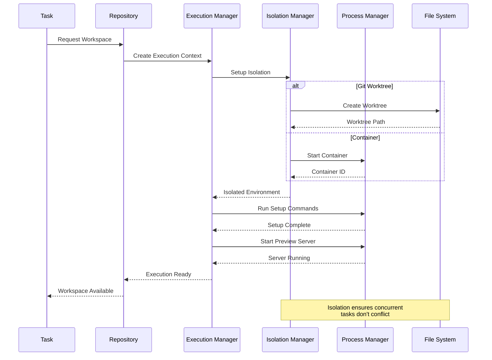
```mermaid
sequenceDiagram
    participant T as Task
    participant R as Repository
    participant E as Execution Manager
    participant I as Isolation Manager
    participant P as Process Manager
    participant F as File System
    
    T->>R: Request Workspace
    R->>E: Create Execution Context
    E->>I: Setup Isolation
    
    alt Git Worktree
        I->>F: Create Worktree
        F-->>I: Worktree Path
    else Container
        I->>P: Start Container
        P-->>I: Container ID
    end
    
    I-->>E: Isolated Environment
    E->>P: Run Setup Commands
    P-->>E: Setup Complete
    E->>P: Start Preview Server
    P-->>E: Server Running
    E-->>R: Execution Ready
    R-->>T: Workspace Available
    
    Note over I,F: Isolation ensures concurrent<br/>tasks don't conflict
```

## Integration Architecture

### System Integration Points
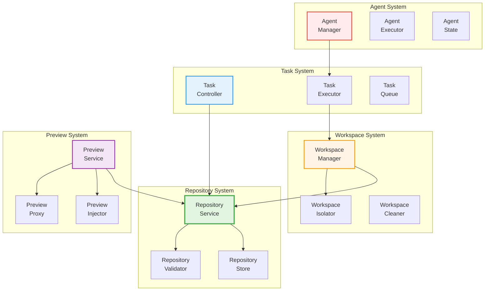
```mermaid
graph TB
    subgraph "Repository System"
        RS[Repository<br/>Service]
        RDB[Repository<br/>Store]
        RV[Repository<br/>Validator]
    end
    
    subgraph "Task System"
        TC[Task<br/>Controller]
        TE[Task<br/>Executor]
        TQ[Task<br/>Queue]
    end
    
    subgraph "Workspace System"
        WM[Workspace<br/>Manager]
        WI[Workspace<br/>Isolator]
        WC[Workspace<br/>Cleaner]
    end
    
    subgraph "Preview System"
        PS[Preview<br/>Service]
        PI[Preview<br/>Injector]
        PP[Preview<br/>Proxy]
    end
    
    subgraph "Agent System"
        AM[Agent<br/>Manager]
        AE[Agent<br/>Executor]
        AS[Agent<br/>State]
    end
    
    TC --> RS
    TE --> WM
    WM --> RS
    PS --> RS
    AM --> TE
    
    RS --> RDB
    RS --> RV
    WM --> WI
    PS --> PI
    PS --> PP
    
    style RS fill:#e1f5e1,stroke:#4caf50,stroke-width:3px
    style TC fill:#e3f2fd,stroke:#2196f3,stroke-width:2px
    style WM fill:#fff4e6,stroke:#ff9800,stroke-width:2px
    style PS fill:#f3e5f5,stroke:#9c27b0,stroke-width:2px
    style AM fill:#ffebee,stroke:#f44336,stroke-width:2px
```

### Data Flow Between Systems
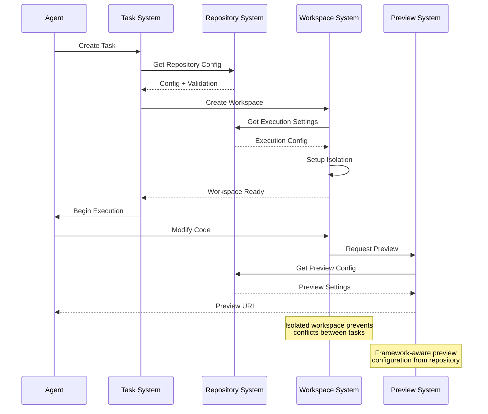
```mermaid
sequenceDiagram
    participant A as Agent
    participant T as Task System
    participant R as Repository System
    participant W as Workspace System
    participant P as Preview System
    
    A->>T: Create Task
    T->>R: Get Repository Config
    R-->>T: Config + Validation
    T->>W: Create Workspace
    W->>R: Get Execution Settings
    R-->>W: Execution Config
    W->>W: Setup Isolation
    W-->>T: Workspace Ready
    T->>A: Begin Execution
    A->>W: Modify Code
    W->>P: Request Preview
    P->>R: Get Preview Config
    R-->>P: Preview Settings
    P-->>A: Preview URL
    
    Note over W: Isolated workspace prevents<br/>conflicts between tasks
    Note over P: Framework-aware preview<br/>configuration from repository
```

## State Management

### Repository State Model
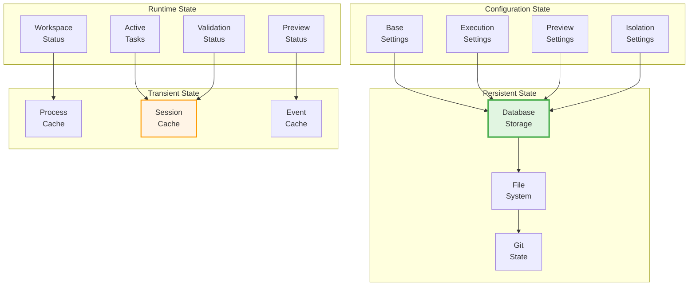
```mermaid
graph TB
    subgraph "Configuration State"
        BS[Base<br/>Settings]
        ES[Execution<br/>Settings]
        PS[Preview<br/>Settings]
        IS[Isolation<br/>Settings]
    end
    
    subgraph "Runtime State"
        AS[Active<br/>Tasks]
        WS[Workspace<br/>Status]
        PS2[Preview<br/>Status]
        VS[Validation<br/>Status]
    end
    
    subgraph "Persistent State"
        DB[Database<br/>Storage]
        FS[File<br/>System]
        GS[Git<br/>State]
    end
    
    subgraph "Transient State"
        PC[Process<br/>Cache]
        SC[Session<br/>Cache]
        EC[Event<br/>Cache]
    end
    
    BS --> DB
    ES --> DB
    PS --> DB
    IS --> DB
    
    AS --> SC
    WS --> PC
    PS2 --> EC
    VS --> SC
    
    DB --> FS
    FS --> GS
    
    style DB fill:#e1f5e1,stroke:#4caf50,stroke-width:3px
    style SC fill:#fff4e6,stroke:#ff9800,stroke-width:2px
```

### State Synchronization
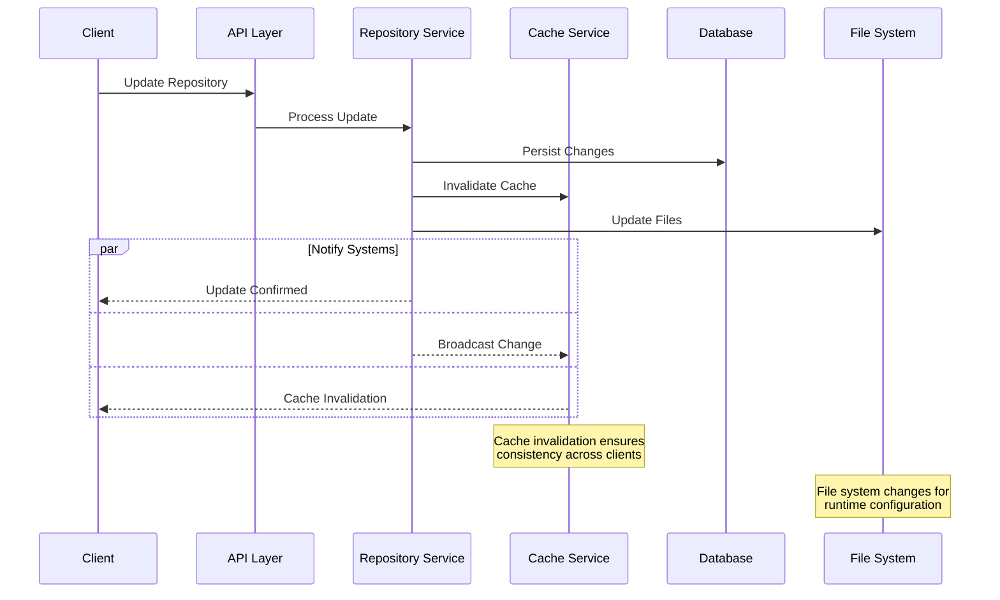
```mermaid
sequenceDiagram
    participant C as Client
    participant API as API Layer
    participant RS as Repository Service
    participant CS as Cache Service
    participant DB as Database
    participant FS as File System
    
    C->>API: Update Repository
    API->>RS: Process Update
    RS->>DB: Persist Changes
    RS->>CS: Invalidate Cache
    RS->>FS: Update Files
    
    par Notify Systems
        RS-->>C: Update Confirmed
    and
        RS-->>CS: Broadcast Change
    and
        CS-->>C: Cache Invalidation
    end
    
    Note over CS: Cache invalidation ensures<br/>consistency across clients
    Note over FS: File system changes for<br/>runtime configuration
```

## Framework Detection System

### Detection Architecture
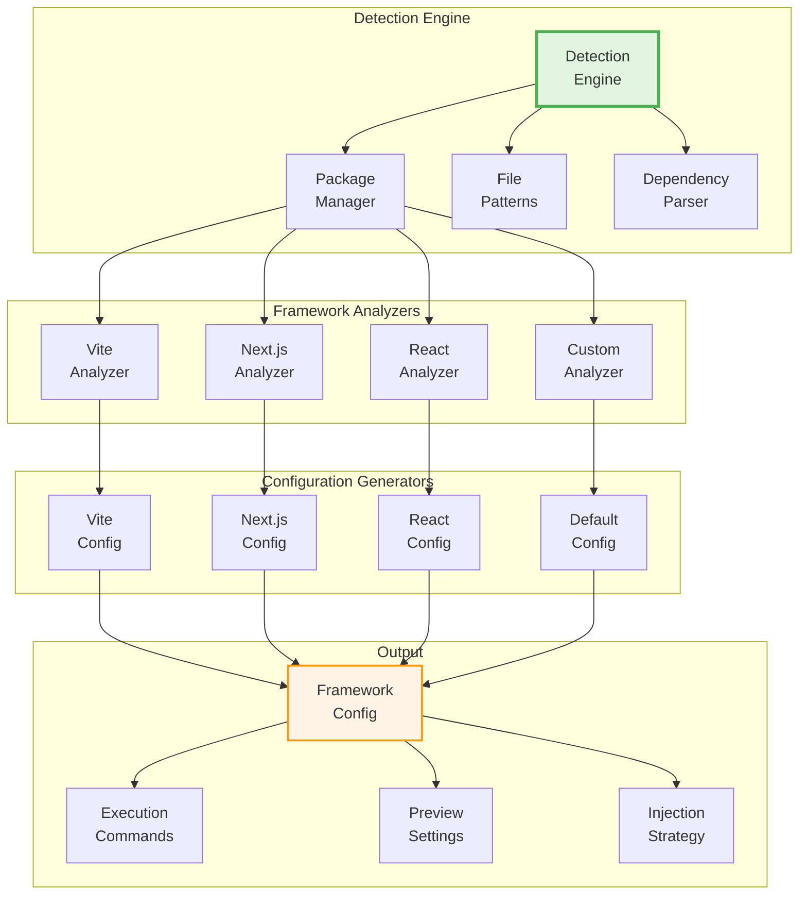
```mermaid
graph TB
    subgraph "Detection Engine"
        DE[Detection<br/>Engine]
        PM[Package<br/>Manager]
        FP[File<br/>Patterns]
        DP[Dependency<br/>Parser]
    end
    
    subgraph "Framework Analyzers"
        VA[Vite<br/>Analyzer]
        NA[Next.js<br/>Analyzer]
        RA[React<br/>Analyzer]
        CA[Custom<br/>Analyzer]
    end
    
    subgraph "Configuration Generators"
        VG[Vite<br/>Config]
        NG[Next.js<br/>Config]
        RG[React<br/>Config]
        DG[Default<br/>Config]
    end
    
    subgraph "Output"
        FC[Framework<br/>Config]
        EC[Execution<br/>Commands]
        PC[Preview<br/>Settings]
        IS[Injection<br/>Strategy]
    end
    
    DE --> PM
    DE --> FP
    DE --> DP
    
    PM --> VA
    PM --> NA
    PM --> RA
    PM --> CA
    
    VA --> VG
    NA --> NG
    RA --> RG
    CA --> DG
    
    VG --> FC
    NG --> FC
    RG --> FC
    DG --> FC
    
    FC --> EC
    FC --> PC
    FC --> IS
    
    style DE fill:#e1f5e1,stroke:#4caf50,stroke-width:3px
    style FC fill:#fff4e6,stroke:#ff9800,stroke-width:2px
```

### Detection Flow
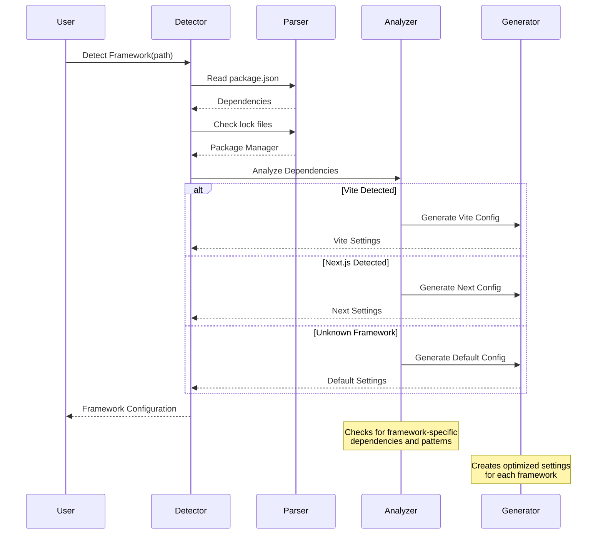
```mermaid
sequenceDiagram
    participant U as User
    participant D as Detector
    participant P as Parser
    participant A as Analyzer
    participant G as Generator
    
    U->>D: Detect Framework(path)
    D->>P: Read package.json
    P-->>D: Dependencies
    D->>P: Check lock files
    P-->>D: Package Manager
    
    D->>A: Analyze Dependencies
    
    alt Vite Detected
        A->>G: Generate Vite Config
        G-->>D: Vite Settings
    else Next.js Detected
        A->>G: Generate Next Config
        G-->>D: Next Settings
    else Unknown Framework
        A->>G: Generate Default Config
        G-->>D: Default Settings
    end
    
    D-->>U: Framework Configuration
    
    Note over A: Checks for framework-specific<br/>dependencies and patterns
    Note over G: Creates optimized settings<br/>for each framework
```

## Configuration Flow

### Configuration Lifecycle
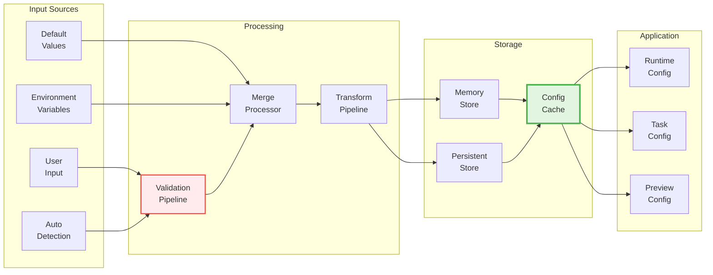
```mermaid
graph LR
    subgraph "Input Sources"
        UI[User<br/>Input]
        AD[Auto<br/>Detection]
        DF[Default<br/>Values]
        EV[Environment<br/>Variables]
    end
    
    subgraph "Processing"
        VP[Validation<br/>Pipeline]
        MP[Merge<br/>Processor]
        TP[Transform<br/>Pipeline]
    end
    
    subgraph "Storage"
        MS[Memory<br/>Store]
        PS[Persistent<br/>Store]
        CS[Config<br/>Cache]
    end
    
    subgraph "Application"
        RT[Runtime<br/>Config]
        TC[Task<br/>Config]
        PC[Preview<br/>Config]
    end
    
    UI --> VP
    AD --> VP
    DF --> MP
    EV --> MP
    
    VP --> MP
    MP --> TP
    TP --> MS
    TP --> PS
    
    MS --> CS
    PS --> CS
    
    CS --> RT
    CS --> TC
    CS --> PC
    
    style VP fill:#ffebee,stroke:#f44336,stroke-width:2px
    style CS fill:#e1f5e1,stroke:#4caf50,stroke-width:3px
```

### Configuration Validation
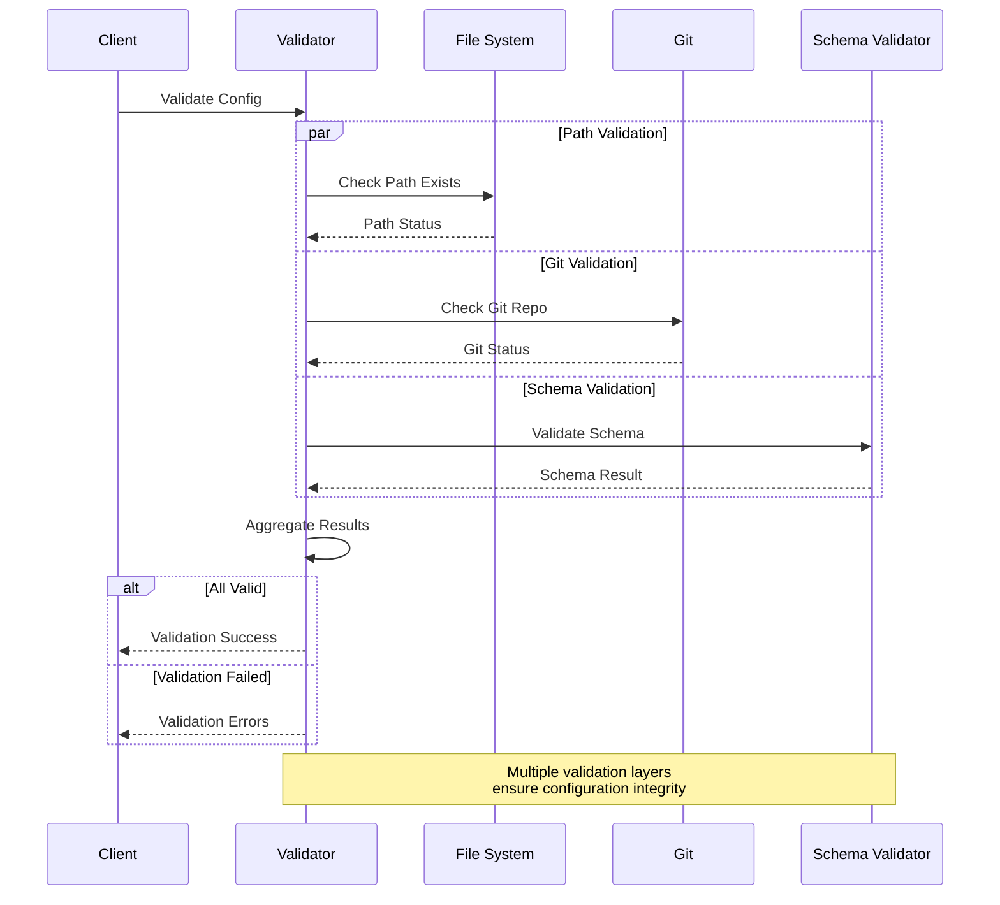
```mermaid
sequenceDiagram
    participant C as Client
    participant V as Validator
    participant F as File System
    participant G as Git
    participant S as Schema Validator
    
    C->>V: Validate Config
    
    par Path Validation
        V->>F: Check Path Exists
        F-->>V: Path Status
    and Git Validation
        V->>G: Check Git Repo
        G-->>V: Git Status
    and Schema Validation
        V->>S: Validate Schema
        S-->>V: Schema Result
    end
    
    V->>V: Aggregate Results
    
    alt All Valid
        V-->>C: Validation Success
    else Validation Failed
        V-->>C: Validation Errors
    end
    
    Note over V,S: Multiple validation layers<br/>ensure configuration integrity
```

## Security Architecture

### Security Layers
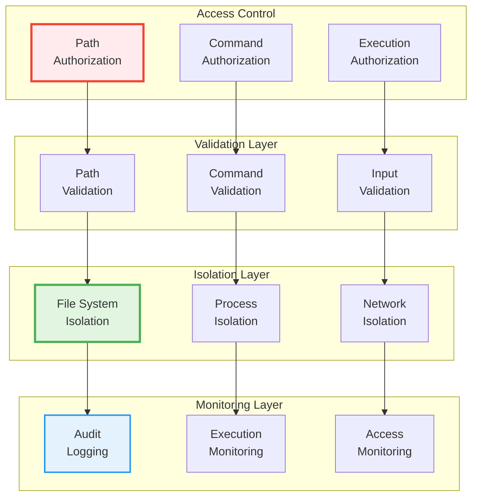
```mermaid
graph TB
    subgraph "Access Control"
        PA[Path<br/>Authorization]
        CA[Command<br/>Authorization]
        EA[Execution<br/>Authorization]
    end
    
    subgraph "Validation Layer"
        PV[Path<br/>Validation]
        CV[Command<br/>Validation]
        IV[Input<br/>Validation]
    end
    
    subgraph "Isolation Layer"
        FI[File System<br/>Isolation]
        PI[Process<br/>Isolation]
        NI[Network<br/>Isolation]
    end
    
    subgraph "Monitoring Layer"
        AL[Audit<br/>Logging]
        EM[Execution<br/>Monitoring]
        AM[Access<br/>Monitoring]
    end
    
    PA --> PV
    CA --> CV
    EA --> IV
    
    PV --> FI
    CV --> PI
    IV --> NI
    
    FI --> AL
    PI --> EM
    NI --> AM
    
    style PA fill:#ffebee,stroke:#f44336,stroke-width:3px
    style FI fill:#e1f5e1,stroke:#4caf50,stroke-width:3px
    style AL fill:#e3f2fd,stroke:#2196f3,stroke-width:2px
```

### Security Flow
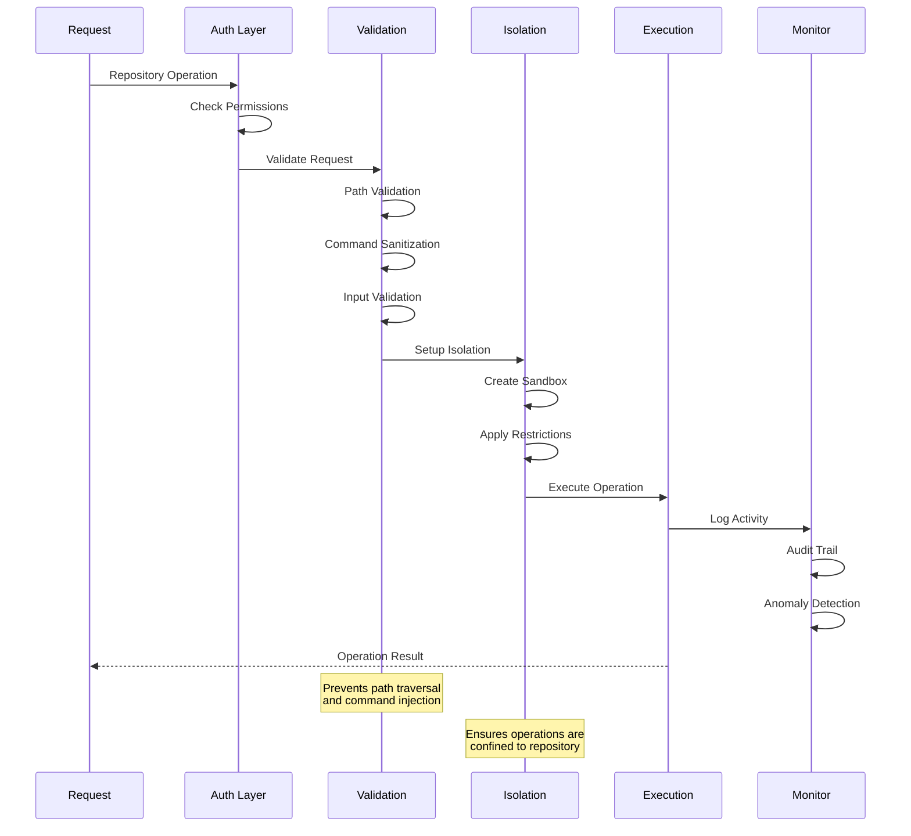
```mermaid
sequenceDiagram
    participant R as Request
    participant A as Auth Layer
    participant V as Validation
    participant I as Isolation
    participant E as Execution
    participant M as Monitor
    
    R->>A: Repository Operation
    A->>A: Check Permissions
    A->>V: Validate Request
    
    V->>V: Path Validation
    V->>V: Command Sanitization
    V->>V: Input Validation
    
    V->>I: Setup Isolation
    I->>I: Create Sandbox
    I->>I: Apply Restrictions
    
    I->>E: Execute Operation
    E->>M: Log Activity
    
    M->>M: Audit Trail
    M->>M: Anomaly Detection
    
    E-->>R: Operation Result
    
    Note over V: Prevents path traversal<br/>and command injection
    Note over I: Ensures operations are<br/>confined to repository
```

## Related Documentation
- [Workspace Architecture](./workspaces.md) - Detailed workspace isolation mechanisms
- [Task Architecture](./tasks.md) - Task execution within repositories
- [Preview Environment Architecture](./preview-environments.md) - Framework-specific preview configuration
- [Agent Architecture](./agents.md) - AI agent interaction with repositories