# Task Architecture

## Overview

The Task system is the central orchestration layer in Moatless Swarm UI, managing AI agent interactions through a sophisticated event-driven architecture. It coordinates isolated workspaces, tracks conversation history, and streams real-time updates while maintaining high performance through strategic caching and optimistic updates.

## Architectural Overview

### System Position & Responsibilities

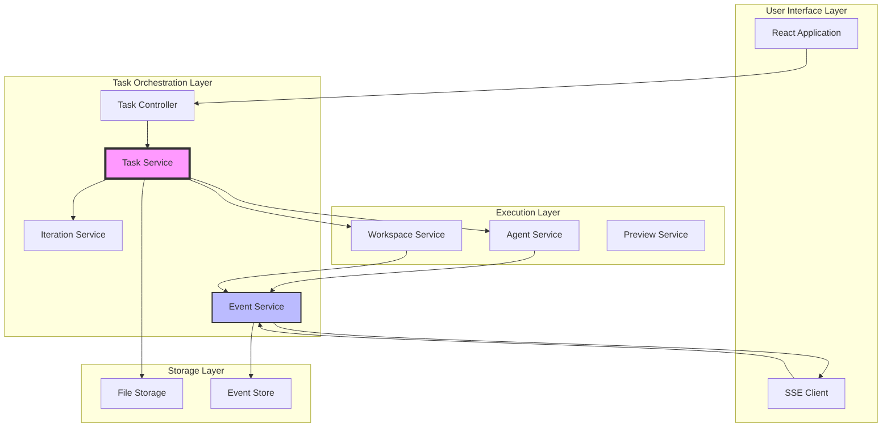
```mermaid
graph TB
    subgraph "User Interface Layer"
        UI[React Application]
        SSE[SSE Client]
    end
    
    subgraph "Task Orchestration Layer"
        TC[Task Controller]
        TS[Task Service]
        ES[Event Service]
        IS[Iteration Service]
    end
    
    subgraph "Execution Layer"
        AS[Agent Service]
        WS[Workspace Service]
        PS[Preview Service]
    end
    
    subgraph "Storage Layer"
        FS[File Storage]
        ES2[Event Store]
    end
    
    UI --> TC
    SSE --> ES
    TC --> TS
    TS --> IS
    TS --> AS
    TS --> WS
    ES --> SSE
    AS --> ES
    WS --> ES
    TS --> FS
    ES --> ES2
    
    style TS fill:#f9f,stroke:#333,stroke-width:4px
    style ES fill:#bbf,stroke:#333,stroke-width:2px
```

### Core Architectural Patterns

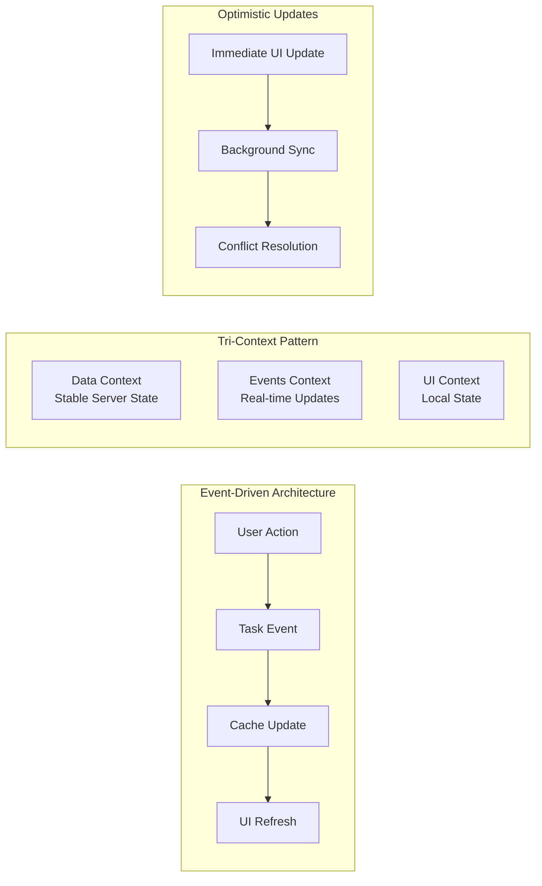
```mermaid
graph LR
    subgraph "Event-Driven Architecture"
        E1[User Action]
        E2[Task Event]
        E3[Cache Update]
        E4[UI Refresh]
        E1 --> E2
        E2 --> E3
        E3 --> E4
    end
    
    subgraph "Tri-Context Pattern"
        DC[Data Context<br/>Stable Server State]
        EC[Events Context<br/>Real-time Updates]
        UC[UI Context<br/>Local State]
    end
    
    subgraph "Optimistic Updates"
        O1[Immediate UI Update]
        O2[Background Sync]
        O3[Conflict Resolution]
        O1 --> O2
        O2 --> O3
    end
```

## Core Architecture

### Task Lifecycle Management

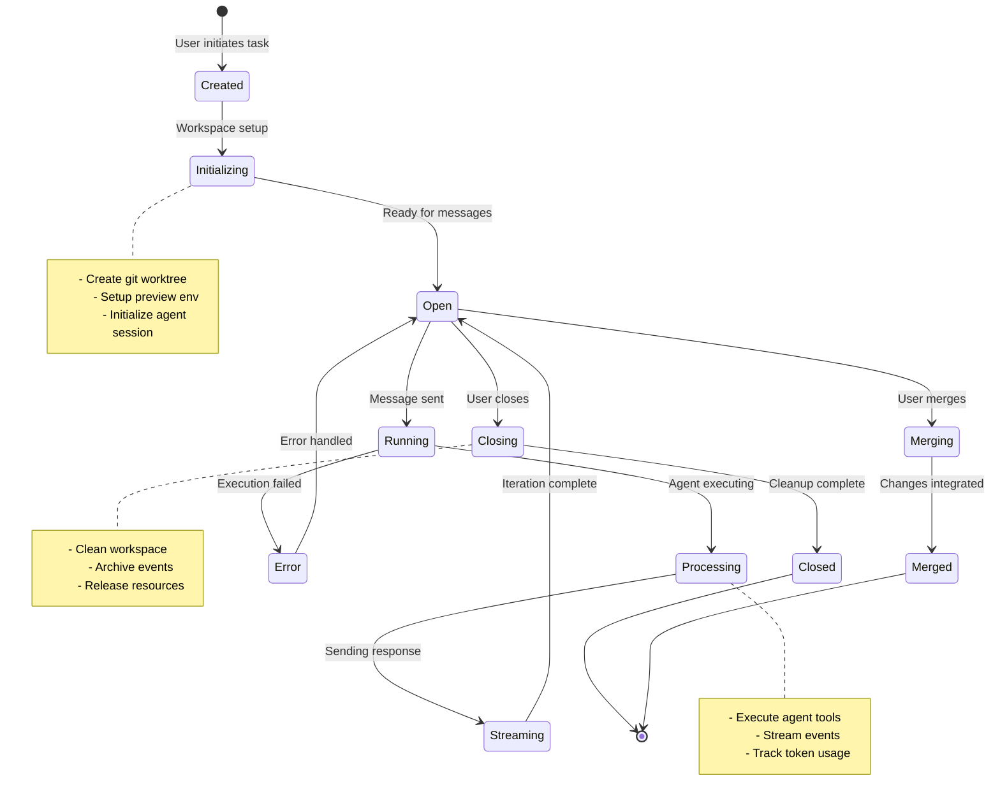
```mermaid
stateDiagram-v2
    [*] --> Created: User initiates task
    Created --> Initializing: Workspace setup
    Initializing --> Open: Ready for messages
    Open --> Running: Message sent
    Running --> Processing: Agent executing
    Processing --> Streaming: Sending response
    Streaming --> Open: Iteration complete
    Running --> Error: Execution failed
    Error --> Open: Error handled
    Open --> Closing: User closes
    Open --> Merging: User merges
    Closing --> Closed: Cleanup complete
    Merging --> Merged: Changes integrated
    Closed --> [*]
    Merged --> [*]
    
    note right of Initializing
        - Create git worktree
        - Setup preview env
        - Initialize agent session
    end note
    
    note right of Processing
        - Execute agent tools
        - Stream events
        - Track token usage
    end note
    
    note right of Closing
        - Clean workspace
        - Archive events
        - Release resources
    end note
```

### Event-Driven Architecture

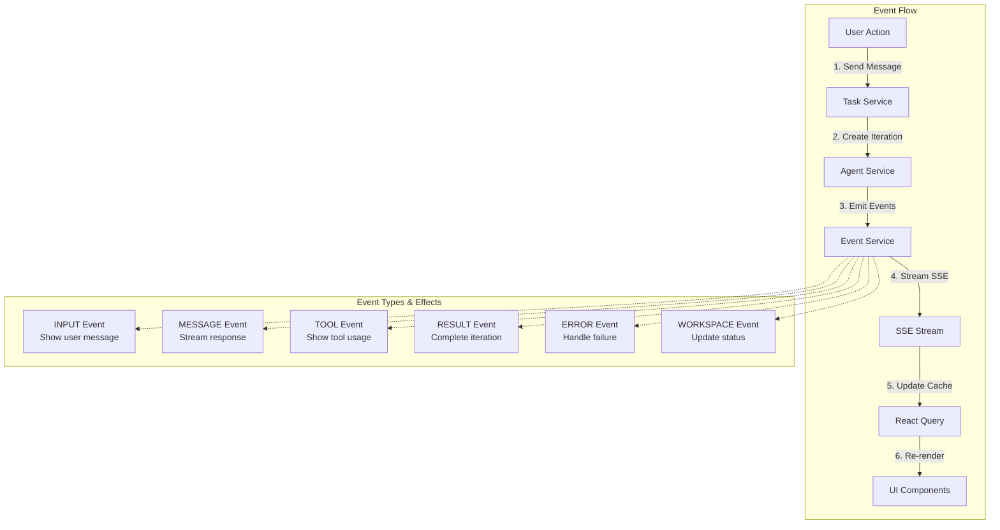
```mermaid
graph TB
    subgraph "Event Flow"
        UA[User Action]
        TS[Task Service]
        AS[Agent Service]
        ES[Event Service]
        SSE[SSE Stream]
        RQ[React Query]
        UI[UI Components]
    end
    
    UA -->|1. Send Message| TS
    TS -->|2. Create Iteration| AS
    AS -->|3. Emit Events| ES
    ES -->|4. Stream SSE| SSE
    SSE -->|5. Update Cache| RQ
    RQ -->|6. Re-render| UI
    
    subgraph "Event Types & Effects"
        E1[INPUT Event<br/>Show user message]
        E2[MESSAGE Event<br/>Stream response]
        E3[TOOL Event<br/>Show tool usage]
        E4[RESULT Event<br/>Complete iteration]
        E5[ERROR Event<br/>Handle failure]
        E6[WORKSPACE Event<br/>Update status]
    end
    
    ES -.-> E1
    ES -.-> E2
    ES -.-> E3
    ES -.-> E4
    ES -.-> E5
    ES -.-> E6
```

### Intelligent Cache Invalidation

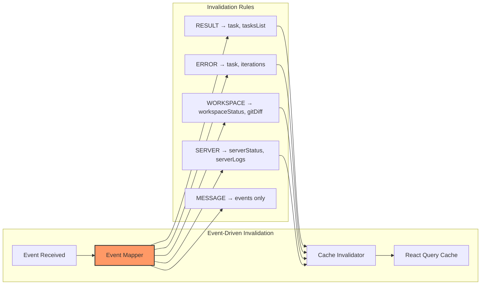
```mermaid
graph LR
    subgraph "Event-Driven Invalidation"
        EV[Event Received]
        EM[Event Mapper]
        CI[Cache Invalidator]
        RQ[React Query Cache]
    end
    
    subgraph "Invalidation Rules"
        R1[RESULT → task, tasksList]
        R2[ERROR → task, iterations]
        R3[WORKSPACE → workspaceStatus, gitDiff]
        R4[SERVER → serverStatus, serverLogs]
        R5[MESSAGE → events only]
    end
    
    EV --> EM
    EM --> R1
    EM --> R2
    EM --> R3
    EM --> R4
    EM --> R5
    R1 --> CI
    R2 --> CI
    R3 --> CI
    R4 --> CI
    CI --> RQ
    
    style EM fill:#f96,stroke:#333,stroke-width:2px
```

## Tri-Context Architecture

### Frontend Performance Pattern

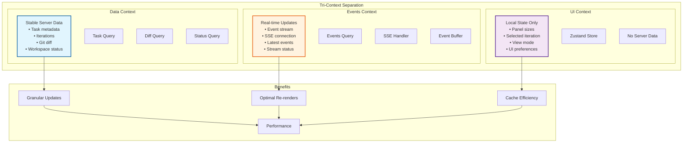
```mermaid
graph TB
    subgraph "Tri-Context Separation"
        subgraph "Data Context"
            DC["Stable Server Data<br/>• Task metadata<br/>• Iterations<br/>• Git diff<br/>• Workspace status"]
            DC1[Task Query]
            DC2[Diff Query]
            DC3[Status Query]
        end
        
        subgraph "Events Context"
            EC["Real-time Updates<br/>• Event stream<br/>• SSE connection<br/>• Latest events<br/>• Stream status"]
            EC1[Events Query]
            EC2[SSE Handler]
            EC3[Event Buffer]
        end
        
        subgraph "UI Context"
            UC["Local State Only<br/>• Panel sizes<br/>• Selected iteration<br/>• View mode<br/>• UI preferences"]
            UC1[Zustand Store]
            UC2[No Server Data]
        end
    end
    
    subgraph "Benefits"
        B1[Granular Updates]
        B2[Optimal Re-renders]
        B3[Cache Efficiency]
        B4[Performance]
    end
    
    DC --> B1
    EC --> B2
    UC --> B3
    B1 --> B4
    B2 --> B4
    B3 --> B4
    
    style DC fill:#e1f5fe,stroke:#01579b,stroke-width:2px
    style EC fill:#fff3e0,stroke:#e65100,stroke-width:2px
    style UC fill:#f3e5f5,stroke:#4a148c,stroke-width:2px
```

### Context Update Patterns

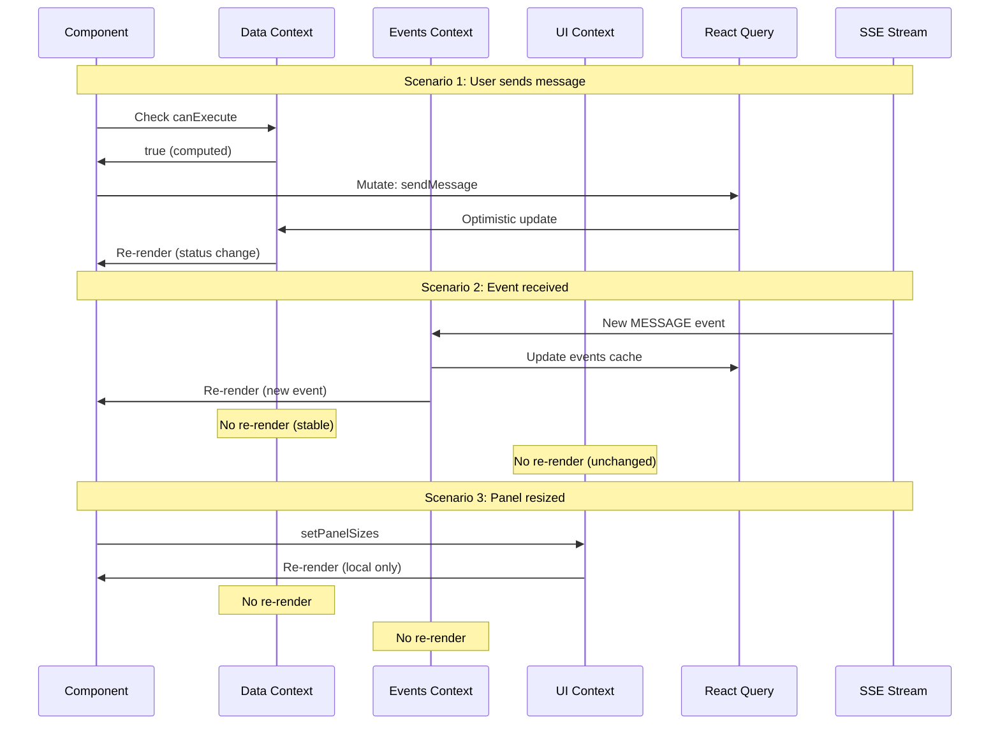
```mermaid
sequenceDiagram
    participant C as Component
    participant DC as Data Context
    participant EC as Events Context
    participant UC as UI Context
    participant RQ as React Query
    participant SSE as SSE Stream
    
    Note over C,SSE: Scenario 1: User sends message
    C->>DC: Check canExecute
    DC->>C: true (computed)
    C->>RQ: Mutate: sendMessage
    RQ->>DC: Optimistic update
    DC->>C: Re-render (status change)
    
    Note over C,SSE: Scenario 2: Event received
    SSE->>EC: New MESSAGE event
    EC->>RQ: Update events cache
    EC->>C: Re-render (new event)
    Note over DC: No re-render (stable)
    Note over UC: No re-render (unchanged)
    
    Note over C,SSE: Scenario 3: Panel resized
    C->>UC: setPanelSizes
    UC->>C: Re-render (local only)
    Note over DC: No re-render
    Note over EC: No re-render
```

## Backend Service Architecture

### Service Layer Design

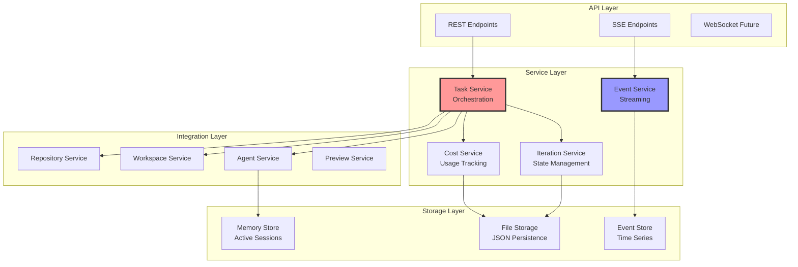
```mermaid
graph TB
    subgraph "API Layer"
        REST[REST Endpoints]
        SSE[SSE Endpoints]
        WS[WebSocket Future]
    end
    
    subgraph "Service Layer"
        TS[Task Service<br/>Orchestration]
        ES[Event Service<br/>Streaming]
        IS[Iteration Service<br/>State Management]
        CS[Cost Service<br/>Usage Tracking]
    end
    
    subgraph "Integration Layer"
        AS[Agent Service]
        WS2[Workspace Service]
        RS[Repository Service]
        PS[Preview Service]
    end
    
    subgraph "Storage Layer"
        FS[File Storage<br/>JSON Persistence]
        MS[Memory Store<br/>Active Sessions]
        ES2[Event Store<br/>Time Series]
    end
    
    REST --> TS
    SSE --> ES
    
    TS --> IS
    TS --> CS
    TS --> AS
    TS --> WS2
    TS --> RS
    
    IS --> FS
    ES --> ES2
    CS --> FS
    AS --> MS
    
    style TS fill:#ff9999,stroke:#333,stroke-width:3px
    style ES fill:#9999ff,stroke:#333,stroke-width:3px
```

### Message Processing Pipeline

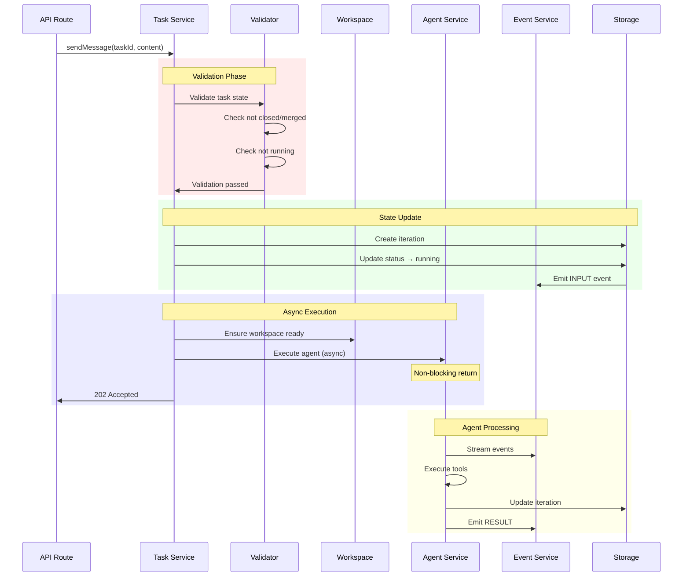
```mermaid
sequenceDiagram
    participant API as API Route
    participant TS as Task Service
    participant Val as Validator
    participant WS as Workspace
    participant AS as Agent Service
    participant ES as Event Service
    participant Store as Storage
    
    API->>TS: sendMessage(taskId, content)
    
    rect rgb(255, 235, 235)
        Note over TS,Val: Validation Phase
        TS->>Val: Validate task state
        Val->>Val: Check not closed/merged
        Val->>Val: Check not running
        Val->>TS: Validation passed
    end
    
    rect rgb(235, 255, 235)
        Note over TS,Store: State Update
        TS->>Store: Create iteration
        TS->>Store: Update status → running
        Store->>ES: Emit INPUT event
    end
    
    rect rgb(235, 235, 255)
        Note over TS,AS: Async Execution
        TS->>WS: Ensure workspace ready
        TS->>AS: Execute agent (async)
        Note over AS: Non-blocking return
        TS->>API: 202 Accepted
    end
    
    rect rgb(255, 255, 235)
        Note over AS,ES: Agent Processing
        AS->>ES: Stream events
        AS->>AS: Execute tools
        AS->>Store: Update iteration
        AS->>ES: Emit RESULT
    end
```

### Error Handling Architecture

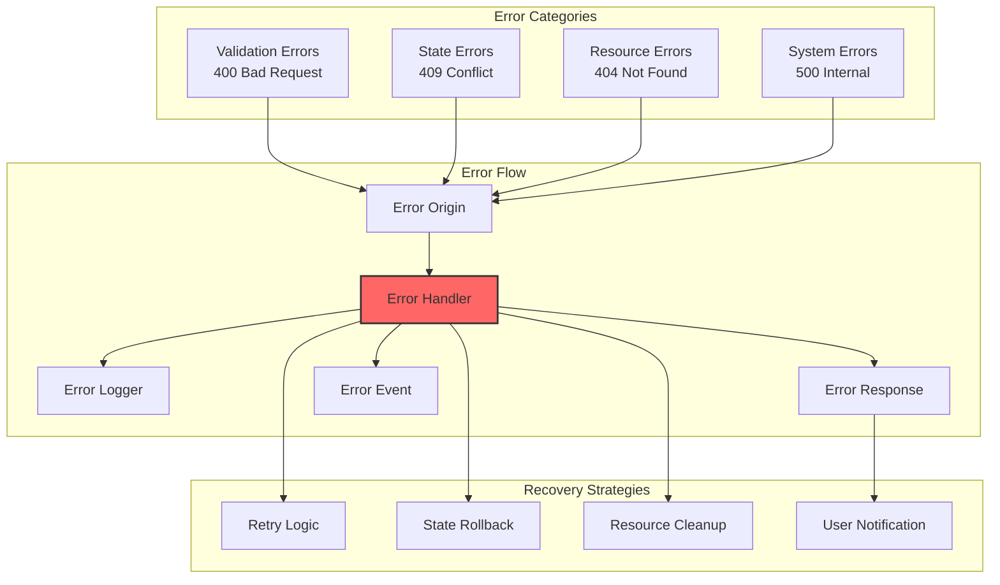
```mermaid
graph TB
    subgraph "Error Categories"
        E1[Validation Errors<br/>400 Bad Request]
        E2[State Errors<br/>409 Conflict]
        E3[Resource Errors<br/>404 Not Found]
        E4[System Errors<br/>500 Internal]
    end
    
    subgraph "Error Flow"
        EO[Error Origin]
        EH[Error Handler]
        EL[Error Logger]
        ER[Error Response]
        EE[Error Event]
    end
    
    subgraph "Recovery Strategies"
        R1[Retry Logic]
        R2[State Rollback]
        R3[Resource Cleanup]
        R4[User Notification]
    end
    
    E1 --> EO
    E2 --> EO
    E3 --> EO
    E4 --> EO
    
    EO --> EH
    EH --> EL
    EH --> ER
    EH --> EE
    
    EH --> R1
    EH --> R2
    EH --> R3
    ER --> R4
    
    style EH fill:#ff6666,stroke:#333,stroke-width:2px
```

### API Design Patterns

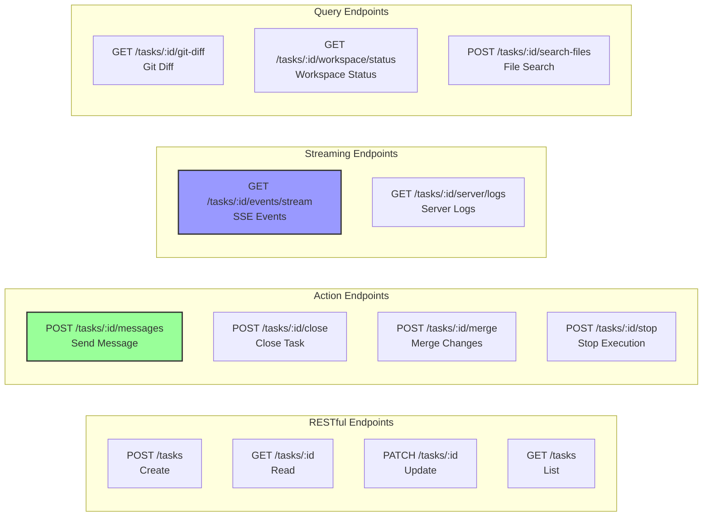
```mermaid
graph LR
    subgraph "RESTful Endpoints"
        CR[POST /tasks<br/>Create]
        RD[GET /tasks/:id<br/>Read]
        UP[PATCH /tasks/:id<br/>Update]
        LS[GET /tasks<br/>List]
    end
    
    subgraph "Action Endpoints"
        SM[POST /tasks/:id/messages<br/>Send Message]
        CL[POST /tasks/:id/close<br/>Close Task]
        MG[POST /tasks/:id/merge<br/>Merge Changes]
        ST[POST /tasks/:id/stop<br/>Stop Execution]
    end
    
    subgraph "Streaming Endpoints"
        EV[GET /tasks/:id/events/stream<br/>SSE Events]
        LG[GET /tasks/:id/server/logs<br/>Server Logs]
    end
    
    subgraph "Query Endpoints"
        GD[GET /tasks/:id/git-diff<br/>Git Diff]
        WS[GET /tasks/:id/workspace/status<br/>Workspace Status]
        SF[POST /tasks/:id/search-files<br/>File Search]
    end
    
    style SM fill:#99ff99,stroke:#333,stroke-width:2px
    style EV fill:#9999ff,stroke:#333,stroke-width:2px
```

### Data Persistence Architecture

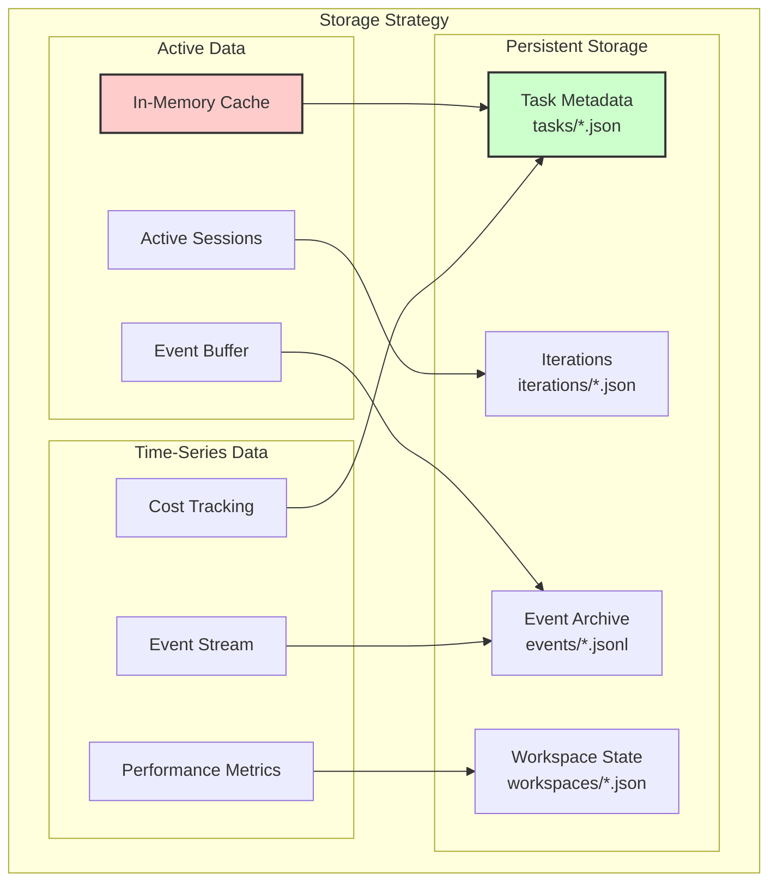
```mermaid
graph TB
    subgraph "Storage Strategy"
        subgraph "Active Data"
            M1[In-Memory Cache]
            M2[Active Sessions]
            M3[Event Buffer]
        end
        
        subgraph "Persistent Storage"
            F1[Task Metadata<br/>tasks/*.json]
            F2[Iterations<br/>iterations/*.json]
            F3[Event Archive<br/>events/*.jsonl]
            F4[Workspace State<br/>workspaces/*.json]
        end
        
        subgraph "Time-Series Data"
            T1[Event Stream]
            T2[Cost Tracking]
            T3[Performance Metrics]
        end
    end
    
    M1 --> F1
    M2 --> F2
    M3 --> F3
    
    T1 --> F3
    T2 --> F1
    T3 --> F4
    
    style M1 fill:#ffcccc,stroke:#333,stroke-width:2px
    style F1 fill:#ccffcc,stroke:#333,stroke-width:2px
```

### State Transition Rules

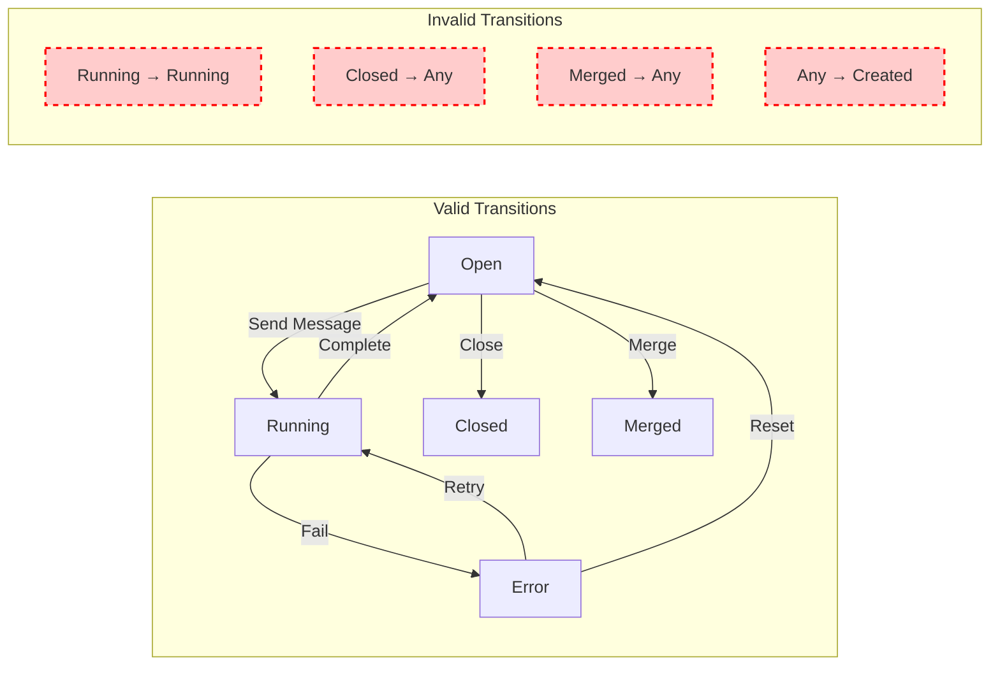
```mermaid
graph LR
    subgraph "Valid Transitions"
        O[Open]
        R[Running]
        E[Error]
        C[Closed]
        M[Merged]
        
        O -->|Send Message| R
        R -->|Complete| O
        R -->|Fail| E
        E -->|Retry| R
        E -->|Reset| O
        O -->|Close| C
        O -->|Merge| M
    end
    
    subgraph "Invalid Transitions"
        X1[Running → Running]
        X2[Closed → Any]
        X3[Merged → Any]
        X4[Any → Created]
    end
    
    style X1 fill:#ffcccc,stroke:#ff0000,stroke-width:2px,stroke-dasharray: 5 5
    style X2 fill:#ffcccc,stroke:#ff0000,stroke-width:2px,stroke-dasharray: 5 5
    style X3 fill:#ffcccc,stroke:#ff0000,stroke-width:2px,stroke-dasharray: 5 5
    style X4 fill:#ffcccc,stroke:#ff0000,stroke-width:2px,stroke-dasharray: 5 5
```

## Frontend Architecture

### Component Architecture

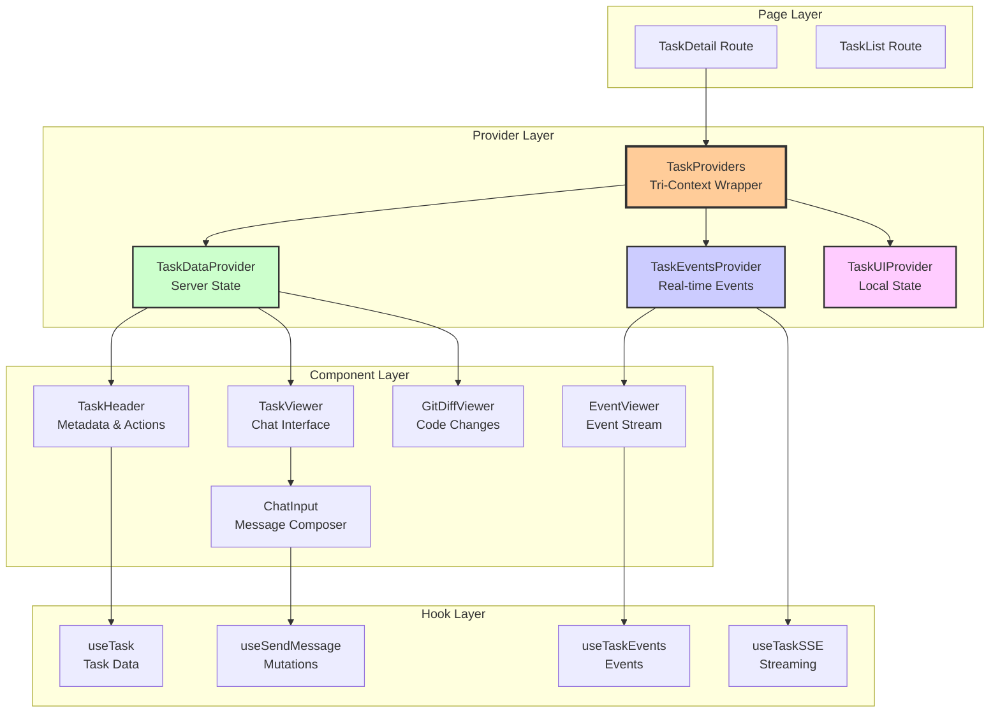
```mermaid
graph TB
    subgraph "Page Layer"
        TD[TaskDetail Route]
        TL[TaskList Route]
    end
    
    subgraph "Provider Layer"
        TP[TaskProviders<br/>Tri-Context Wrapper]
        TDP[TaskDataProvider<br/>Server State]
        TEP[TaskEventsProvider<br/>Real-time Events]
        TUP[TaskUIProvider<br/>Local State]
    end
    
    subgraph "Component Layer"
        TH[TaskHeader<br/>Metadata & Actions]
        TV[TaskViewer<br/>Chat Interface]
        EV[EventViewer<br/>Event Stream]
        GD[GitDiffViewer<br/>Code Changes]
        CI[ChatInput<br/>Message Composer]
    end
    
    subgraph "Hook Layer"
        H1[useTask<br/>Task Data]
        H2[useTaskEvents<br/>Events]
        H3[useSendMessage<br/>Mutations]
        H4[useTaskSSE<br/>Streaming]
    end
    
    TD --> TP
    TP --> TDP
    TP --> TEP
    TP --> TUP
    
    TDP --> TH
    TDP --> TV
    TEP --> EV
    TDP --> GD
    TV --> CI
    
    TH --> H1
    EV --> H2
    CI --> H3
    TEP --> H4
    
    style TP fill:#ffcc99,stroke:#333,stroke-width:3px
    style TDP fill:#ccffcc,stroke:#333,stroke-width:2px
    style TEP fill:#ccccff,stroke:#333,stroke-width:2px
    style TUP fill:#ffccff,stroke:#333,stroke-width:2px
```

### React Query Integration

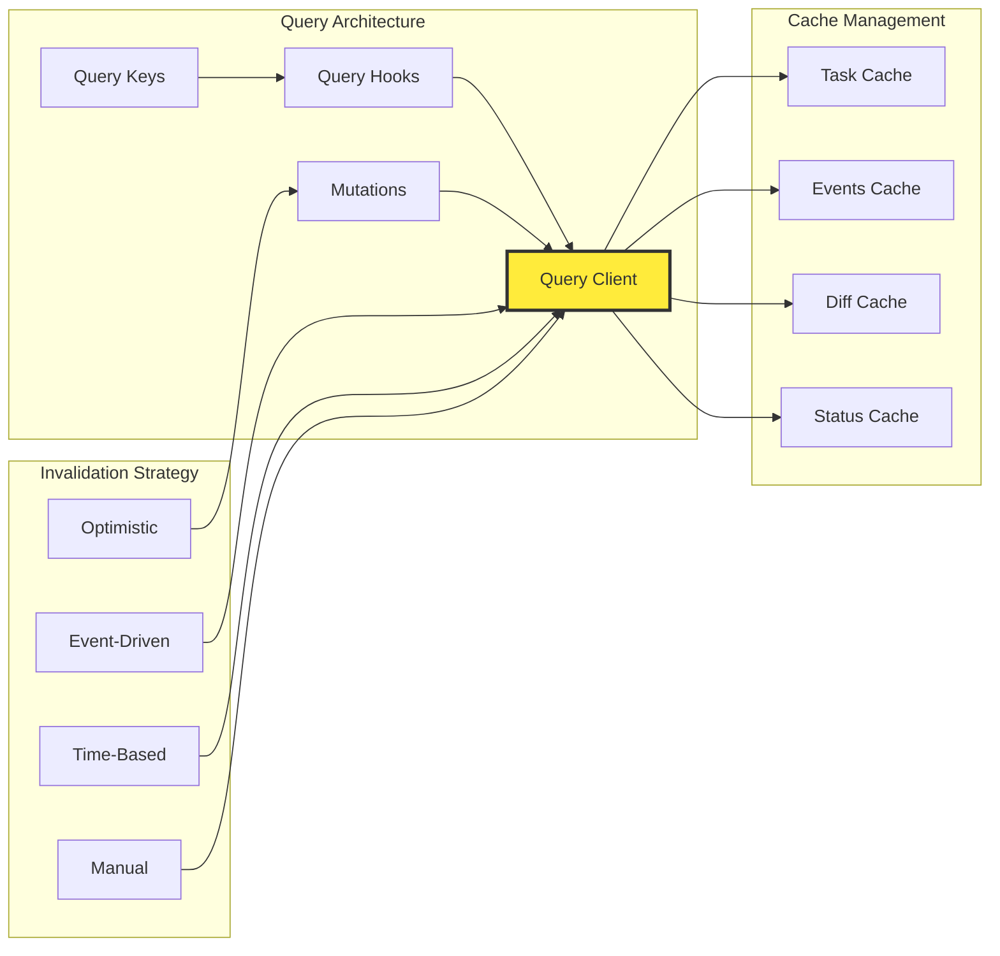
```mermaid
graph LR
    subgraph "Query Architecture"
        QC[Query Client]
        QK[Query Keys]
        QH[Query Hooks]
        QM[Mutations]
    end
    
    subgraph "Cache Management"
        C1[Task Cache]
        C2[Events Cache]
        C3[Diff Cache]
        C4[Status Cache]
    end
    
    subgraph "Invalidation Strategy"
        I1[Event-Driven]
        I2[Time-Based]
        I3[Manual]
        I4[Optimistic]
    end
    
    QC --> C1
    QC --> C2
    QC --> C3
    QC --> C4
    
    QK --> QH
    QH --> QC
    QM --> QC
    
    I1 --> QC
    I2 --> QC
    I3 --> QC
    I4 --> QM
    
    style QC fill:#ffeb3b,stroke:#333,stroke-width:3px
```

### Optimistic Update Architecture

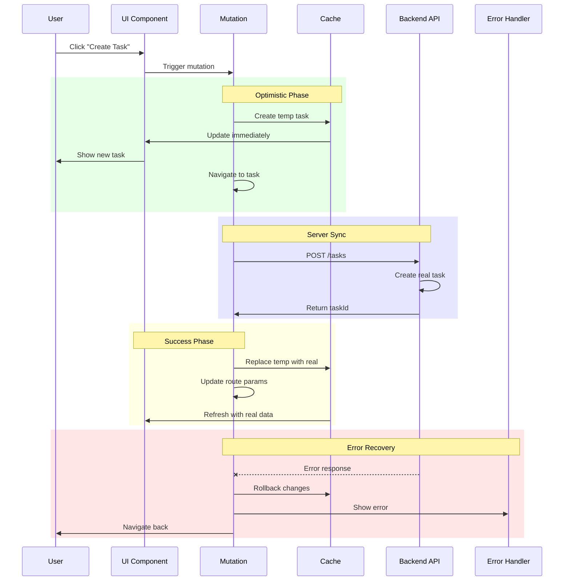
```mermaid
sequenceDiagram
    participant U as User
    participant UI as UI Component
    participant M as Mutation
    participant C as Cache
    participant API as Backend API
    participant E as Error Handler
    
    U->>UI: Click "Create Task"
    UI->>M: Trigger mutation
    
    rect rgb(230, 255, 230)
        Note over M,C: Optimistic Phase
        M->>C: Create temp task
        C->>UI: Update immediately
        UI->>U: Show new task
        M->>M: Navigate to task
    end
    
    rect rgb(230, 230, 255)
        Note over M,API: Server Sync
        M->>API: POST /tasks
        API->>API: Create real task
        API->>M: Return taskId
    end
    
    rect rgb(255, 255, 230)
        Note over M,UI: Success Phase
        M->>C: Replace temp with real
        M->>M: Update route params
        C->>UI: Refresh with real data
    end
    
    rect rgb(255, 230, 230)
        Note over M,E: Error Recovery
        API--xM: Error response
        M->>C: Rollback changes
        M->>E: Show error
        M->>U: Navigate back
    end
```

### SSE Connection Management

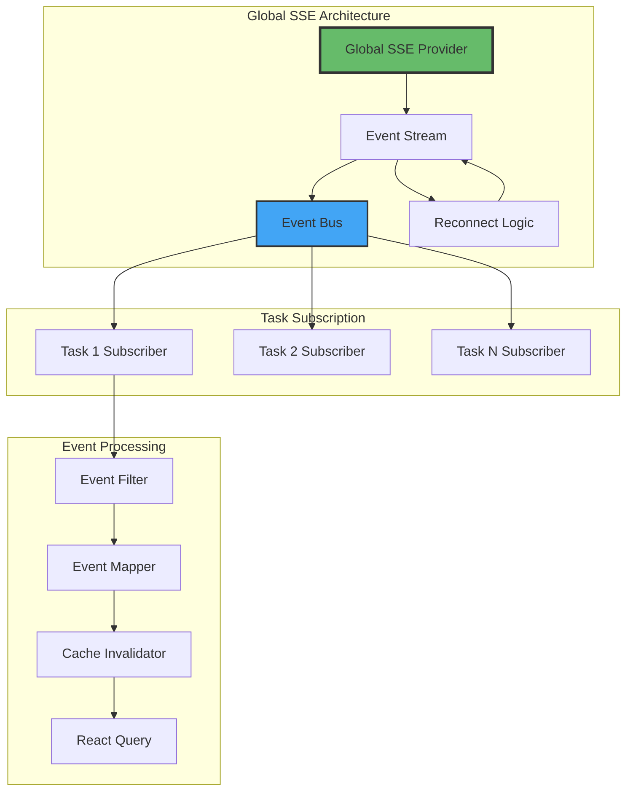
```mermaid
graph TB
    subgraph "Global SSE Architecture"
        GS[Global SSE Provider]
        ES[Event Stream]
        EB[Event Bus]
        RC[Reconnect Logic]
    end
    
    subgraph "Task Subscription"
        TS1[Task 1 Subscriber]
        TS2[Task 2 Subscriber]
        TS3[Task N Subscriber]
    end
    
    subgraph "Event Processing"
        EF[Event Filter]
        EM[Event Mapper]
        CI[Cache Invalidator]
        RQ[React Query]
    end
    
    GS --> ES
    ES --> EB
    ES --> RC
    RC --> ES
    
    EB --> TS1
    EB --> TS2
    EB --> TS3
    
    TS1 --> EF
    EF --> EM
    EM --> CI
    CI --> RQ
    
    style GS fill:#66bb6a,stroke:#333,stroke-width:3px
    style EB fill:#42a5f5,stroke:#333,stroke-width:2px
```

## Performance Optimization Patterns

### Context Optimization Strategy

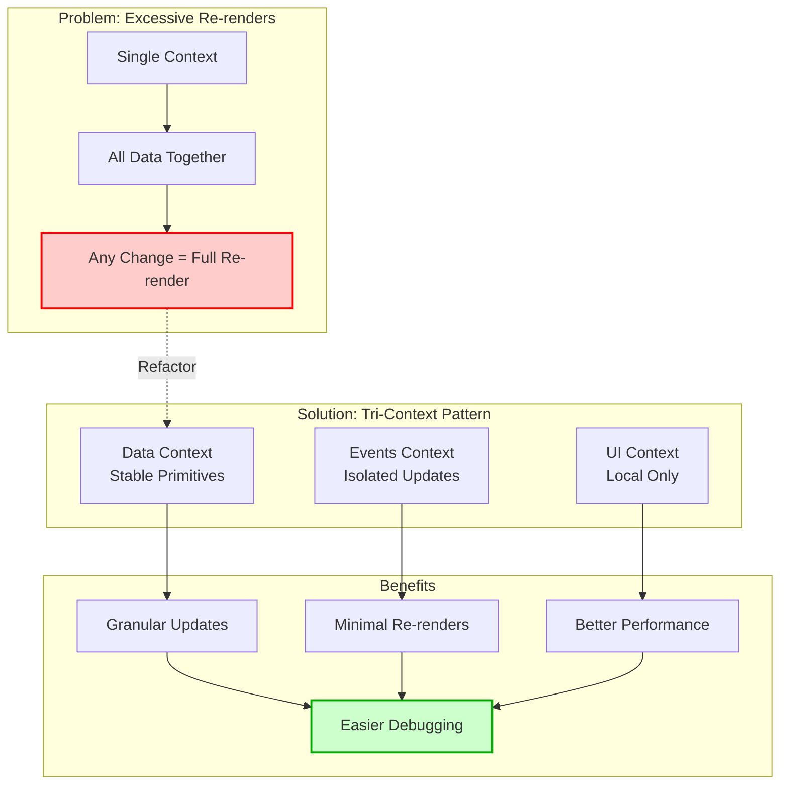
```mermaid
graph TB
    subgraph "Problem: Excessive Re-renders"
        P1[Single Context]
        P2[All Data Together]
        P3[Any Change = Full Re-render]
        P1 --> P2
        P2 --> P3
    end
    
    subgraph "Solution: Tri-Context Pattern"
        S1[Data Context<br/>Stable Primitives]
        S2[Events Context<br/>Isolated Updates]
        S3[UI Context<br/>Local Only]
    end
    
    subgraph "Benefits"
        B1[Granular Updates]
        B2[Minimal Re-renders]
        B3[Better Performance]
        B4[Easier Debugging]
    end
    
    P3 -.->|Refactor| S1
    S1 --> B1
    S2 --> B2
    S3 --> B3
    B1 --> B4
    B2 --> B4
    B3 --> B4
    
    style P3 fill:#ffcccc,stroke:#ff0000,stroke-width:2px
    style B4 fill:#ccffcc,stroke:#00aa00,stroke-width:2px
```

### Smart Polling Architecture

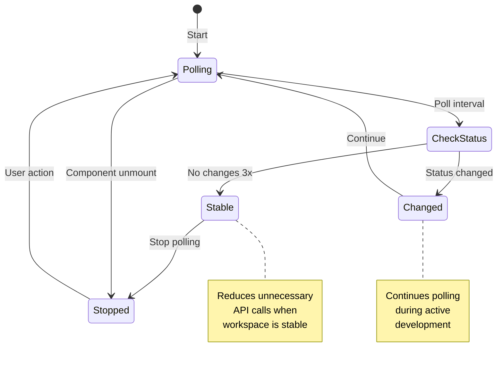
```mermaid
stateDiagram-v2
    [*] --> Polling: Start
    Polling --> CheckStatus: Poll interval
    CheckStatus --> Stable: No changes 3x
    CheckStatus --> Changed: Status changed
    Changed --> Polling: Continue
    Stable --> Stopped: Stop polling
    Stopped --> Polling: User action
    Polling --> Stopped: Component unmount
    
    note right of Stable
        Reduces unnecessary
        API calls when
        workspace is stable
    end note
    
    note right of Changed
        Continues polling
        during active
        development
    end note
```

### Cache Warming Strategy

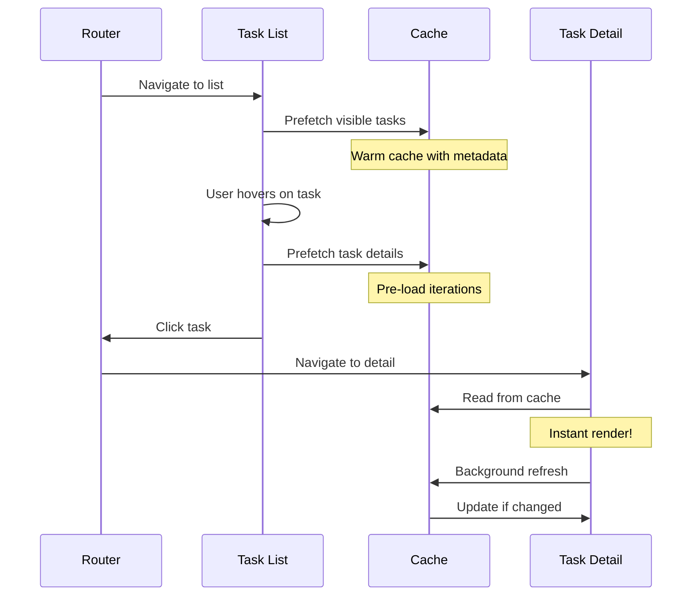
```mermaid
sequenceDiagram
    participant R as Router
    participant L as Task List
    participant C as Cache
    participant D as Task Detail
    
    R->>L: Navigate to list
    L->>C: Prefetch visible tasks
    Note over C: Warm cache with metadata
    
    L->>L: User hovers on task
    L->>C: Prefetch task details
    Note over C: Pre-load iterations
    
    L->>R: Click task
    R->>D: Navigate to detail
    D->>C: Read from cache
    Note over D: Instant render!
    
    D->>C: Background refresh
    C->>D: Update if changed
```

## Data Flow Architecture

### Complete Request Lifecycle

```mermaid
sequenceDiagram
    participant U as User
    participant UI as React UI
    participant RQ as React Query
    participant API as API Client
    participant BE as Backend
    participant AS as Agent Service
    participant SSE as SSE Stream
    
    rect rgb(240, 248, 255)
        Note over U,UI: User Interaction
        U->>UI: Type message
        UI->>UI: Update local state
        U->>UI: Click send
    end
    
    rect rgb(240, 255, 240)
        Note over UI,RQ: Optimistic Update
        UI->>RQ: Trigger mutation
        RQ->>RQ: Update cache optimistically
        RQ->>UI: Re-render with pending state
    end
    
    rect rgb(255, 248, 220)
        Note over RQ,BE: API Request
        RQ->>API: POST /tasks/:id/messages
        API->>BE: Forward request
        BE->>BE: Validate & create iteration
        BE->>AS: Queue agent execution
        BE->>API: Return 202 Accepted
        API->>RQ: Success response
    end
    
    rect rgb(255, 240, 240)
        Note over AS,SSE: Async Processing
        AS->>AS: Execute agent
        AS->>SSE: Stream MESSAGE events
        SSE->>UI: Update via EventsContext
        AS->>SSE: Send RESULT event
        SSE->>RQ: Trigger cache invalidation
        RQ->>UI: Re-render with final state
    end
```

### Event-Driven Cache Updates

```mermaid
graph TB
    subgraph "Event Stream"
        E1[INPUT Event]
        E2[MESSAGE Event]
        E3[TOOL Event]
        E4[RESULT Event]
        E5[ERROR Event]
        E6[WORKSPACE Event]
    end
    
    subgraph "Cache Operations"
        U1[Update Events List]
        U2[Invalidate Task]
        U3[Invalidate Iterations]
        U4[Update Git Diff]
        U5[Update Workspace Status]
    end
    
    subgraph "UI Updates"
        R1[Show User Message]
        R2[Stream AI Response]
        R3[Show Tool Usage]
        R4[Complete Iteration]
        R5[Show Error State]
        R6[Update Status Badge]
    end
    
    E1 --> U1 --> R1
    E2 --> U1 --> R2
    E3 --> U1 --> R3
    E4 --> U2 --> R4
    E4 --> U3
    E5 --> U2 --> R5
    E6 --> U5 --> R6
    E6 --> U4
    
    style E4 fill:#90ee90,stroke:#333,stroke-width:2px
    style U2 fill:#ffd700,stroke:#333,stroke-width:2px
```

### Workspace Integration

```mermaid
graph TB
    subgraph "Task-Workspace Relationship"
        T[Task]
        W[Workspace]
        G[Git Worktree]
        P[Preview Server]
    end
    
    subgraph "Lifecycle Coordination"
        L1[Task Created]
        L2[Workspace Allocated]
        L3[Worktree Created]
        L4[Preview Started]
        L5[Ready for Execution]
    end
    
    subgraph "State Synchronization"
        S1[File Changes]
        S2[Git Status]
        S3[Server Status]
        S4[Build Status]
    end
    
    T -->|1:1| W
    W -->|Uses| G
    W -->|Hosts| P
    
    L1 --> L2
    L2 --> L3
    L3 --> L4
    L4 --> L5
    
    S1 --> W
    S2 --> G
    S3 --> P
    S4 --> P
    
    W --> T
    
    style T fill:#ff9999,stroke:#333,stroke-width:3px
    style W fill:#9999ff,stroke:#333,stroke-width:3px
```

### Cost Tracking Architecture

```mermaid
sequenceDiagram
    participant A as Agent
    participant C as Cost Calculator
    participant T as Task Service
    participant S as Storage
    participant U as UI
    
    A->>A: Execute tools
    A->>A: Track token usage
    A->>C: Calculate costs
    
    rect rgb(255, 245, 230)
        Note over C: Cost Calculation
        C->>C: Input tokens × rate
        C->>C: Output tokens × rate
        C->>C: Cache tokens × rate
        C->>C: Sum total cost
    end
    
    C->>T: Update iteration cost
    T->>T: Aggregate task total
    T->>S: Persist costs
    T->>U: Stream cost update
    
    U->>U: Display running total
    U->>U: Show cost breakdown
```

## Integration Architecture

### Service Dependencies

```mermaid
graph TB
    subgraph "Core Services"
        TS[Task Service<br/>Orchestrator]
        ES[Event Service<br/>Real-time]
        AS[Agent Service<br/>AI Execution]
        WS[Workspace Service<br/>File System]
    end
    
    subgraph "Supporting Services"
        RS[Repository Service<br/>Git Operations]
        PS[Preview Service<br/>Dev Server]
        CS[Cost Service<br/>Usage Tracking]
        SS[Storage Service<br/>Persistence]
    end
    
    subgraph "External Dependencies"
        AI[AI Provider<br/>Claude/GPT]
        GIT[Git<br/>Version Control]
        FS[File System<br/>Storage]
        PM[Package Manager<br/>npm/pnpm]
    end
    
    TS --> AS
    TS --> WS
    TS --> ES
    TS --> CS
    
    AS --> AI
    WS --> RS
    WS --> GIT
    WS --> FS
    PS --> PM
    RS --> GIT
    
    ES --> SS
    CS --> SS
    TS --> SS
    
    style TS fill:#ff6666,stroke:#333,stroke-width:4px
    style ES fill:#6666ff,stroke:#333,stroke-width:3px
    style AS fill:#66ff66,stroke:#333,stroke-width:3px
```

### Event Bus Architecture

```mermaid
graph LR
    subgraph "Event Producers"
        P1[Task Service]
        P2[Agent Service]
        P3[Workspace Service]
        P4[Preview Service]
    end
    
    subgraph "Event Bus"
        EB[Central Event Bus]
        EQ[Event Queue]
        ES[Event Store]
    end
    
    subgraph "Event Consumers"
        C1[SSE Stream]
        C2[Cost Calculator]
        C3[Analytics]
        C4[Audit Logger]
    end
    
    P1 --> EB
    P2 --> EB
    P3 --> EB
    P4 --> EB
    
    EB --> EQ
    EB --> ES
    
    EQ --> C1
    EQ --> C2
    EQ --> C3
    EQ --> C4
    
    style EB fill:#ffd700,stroke:#333,stroke-width:3px
```

## Architectural Benefits

### Performance Achievements

```mermaid
graph TB
    subgraph "Traditional Approach"
        T1[Single Context]
        T2[Full Re-renders]
        T3[Polling Everything]
        T4[Synchronous Updates]
        T5[Poor Performance]
        
        T1 --> T2
        T2 --> T5
        T3 --> T5
        T4 --> T5
    end
    
    subgraph "Optimized Architecture"
        O1[Tri-Context Pattern]
        O2[Granular Updates]
        O3[Smart Polling]
        O4[Optimistic Updates]
        O5[Excellent Performance]
        
        O1 --> O2
        O2 --> O5
        O3 --> O5
        O4 --> O5
    end
    
    subgraph "Key Metrics"
        M1["Re-renders: 90% reduction"]
        M2["API calls: 70% reduction"]
        M3["Response time: <100ms"]
        M4["Bundle size: Optimized"]
    end
    
    O5 --> M1
    O5 --> M2
    O5 --> M3
    O5 --> M4
    
    style T5 fill:#ffcccc,stroke:#ff0000,stroke-width:2px
    style O5 fill:#ccffcc,stroke:#00aa00,stroke-width:2px
```

### Scalability Patterns

```mermaid
graph LR
    subgraph "Horizontal Scaling"
        H1[Stateless Services]
        H2[Event-Driven]
        H3[Cache Distribution]
        H4[Load Balancing]
    end
    
    subgraph "Vertical Scaling"
        V1[Efficient Algorithms]
        V2[Memory Management]
        V3[Connection Pooling]
        V4[Resource Limits]
    end
    
    subgraph "Resilience"
        R1[Circuit Breakers]
        R2[Retry Logic]
        R3[Graceful Degradation]
        R4[Error Recovery]
    end
    
    H1 --> Scale["Handles 1000+ concurrent tasks"]
    H2 --> Scale
    V1 --> Scale
    V2 --> Scale
    R1 --> Scale
    R2 --> Scale
    
    style Scale fill:#4caf50,stroke:#333,stroke-width:3px
```

## Best Practices & Patterns

### Architectural Principles

```mermaid
graph TB
    subgraph "Core Principles"
        P1["Single Responsibility<br/>Each service has one job"]
        P2["Event-Driven<br/>Loose coupling via events"]
        P3["Fail Fast<br/>Early validation"]
        P4["Graceful Degradation<br/>Partial failures OK"]
    end
    
    subgraph "Performance Principles"
        PP1["Cache First<br/>Minimize API calls"]
        PP2["Optimistic UI<br/>Immediate feedback"]
        PP3["Lazy Loading<br/>Load on demand"]
        PP4["Smart Polling<br/>Adaptive intervals"]
    end
    
    subgraph "Reliability Principles"
        RP1["Idempotent Operations<br/>Safe retries"]
        RP2["Transaction Logs<br/>Event sourcing"]
        RP3["Health Checks<br/>Self-healing"]
        RP4["Resource Limits<br/>Prevent abuse"]
    end
    
    style P2 fill:#4caf50,stroke:#333,stroke-width:2px
    style PP2 fill:#2196f3,stroke:#333,stroke-width:2px
    style RP1 fill:#ff9800,stroke:#333,stroke-width:2px
```

### Common Patterns

1. **Event-Driven Cache Invalidation**
   - Events trigger targeted cache updates
   - Minimizes unnecessary re-fetches
   - Maintains consistency

2. **Optimistic Updates**
   - Immediate UI feedback
   - Background synchronization
   - Graceful rollback on error

3. **Tri-Context Separation**
   - Stable data context
   - Volatile events context
   - Local UI state context

4. **Smart Resource Management**
   - Adaptive polling intervals
   - Connection pooling
   - Automatic cleanup

5. **Graceful Error Handling**
   - Typed error classes
   - User-friendly messages
   - Automatic recovery

## Future Enhancements

### Planned Architectural Improvements

```mermaid
graph TB
    subgraph "Current State"
        C1[SSE Streaming]
        C2[File Storage]
        C3[Single Region]
        C4[Basic Metrics]
    end
    
    subgraph "Future State"
        F1[WebSocket Upgrade]
        F2[Database Backend]
        F3[Multi-Region]
        F4[Advanced Analytics]
    end
    
    subgraph "Benefits"
        B1[Bidirectional Comm]
        B2[Better Querying]
        B3[Global Scale]
        B4[Deep Insights]
    end
    
    C1 -.->|Upgrade| F1
    C2 -.->|Migrate| F2
    C3 -.->|Expand| F3
    C4 -.->|Enhance| F4
    
    F1 --> B1
    F2 --> B2
    F3 --> B3
    F4 --> B4
    
    style F1 fill:#e3f2fd,stroke:#1976d2,stroke-width:2px
    style F2 fill:#e8f5e9,stroke:#388e3c,stroke-width:2px
    style F3 fill:#fff3e0,stroke:#f57c00,stroke-width:2px
    style F4 fill:#fce4ec,stroke:#c2185b,stroke-width:2px
```

### Architectural Evolution

1. **Real-time Collaboration**
   - Multiple users per task
   - Conflict resolution
   - Presence indicators

2. **Advanced Caching**
   - Distributed cache (Redis)
   - Predictive prefetching
   - Offline support

3. **Enhanced Monitoring**
   - Performance tracking
   - Cost analytics
   - Usage patterns

4. **AI Improvements**
   - Multi-agent tasks
   - Custom tool integration
   - Learning from feedback

## Summary

The Task Architecture represents a sophisticated orchestration system that coordinates AI agents, workspaces, and real-time events through carefully designed patterns:

### Key Architectural Achievements

1. **Performance Excellence**
   - 90% reduction in unnecessary re-renders through tri-context pattern
   - Sub-100ms response times via optimistic updates
   - 70% fewer API calls through smart caching

2. **Scalability by Design**
   - Event-driven architecture enables horizontal scaling
   - Stateless services support load balancing
   - Resource limits prevent system abuse

3. **Developer Experience**
   - Clear separation of concerns
   - Predictable state management
   - Comprehensive error handling

4. **User Experience**
   - Real-time feedback via SSE
   - Immediate UI updates
   - Graceful error recovery

The architecture's strength lies in its layered approach, where each layer has clear responsibilities and communicates through well-defined interfaces. This design enables the system to handle complex AI-driven workflows while maintaining performance and reliability.

## Related Documentation

- [Architecture Overview](../architecture-overview.md) - System-wide architecture
- [Event Architecture](../event-architecture.md) - Deep dive into event system
- [Frontend Task Architecture](../frontend-task-architecture.md) - Frontend patterns
- [Workspace Architecture](../workspace-architecture.md) - Workspace management
- [Agent Architecture](./agents.md) - AI agent integration
- [Tri-Context Pattern](../patterns/tri-context.md) - Performance optimization
- [Optimistic Updates](../patterns/optimistic-updates.md) - UI responsiveness
- [Cache Invalidation](../patterns/cache-invalidation.md) - Cache strategies