# Workspace Architecture

## Table of Contents
1. [Overview](#overview)
2. [Architectural Principles](#architectural-principles)
3. [Core Architecture](#core-architecture)
4. [Isolation Architecture](#isolation-architecture)
5. [Lifecycle Management](#lifecycle-management)
6. [Security Architecture](#security-architecture)
7. [Integration Architecture](#integration-architecture)
8. [Performance & Scalability](#performance--scalability)
9. [Monitoring & Observability](#monitoring--observability)
10. [Best Practices](#best-practices)

## Overview

### Purpose
The Workspace system creates **isolated execution environments** for AI agents, enabling safe and concurrent task execution while maintaining complete separation between tasks and protecting the main repository.

### Key Capabilities
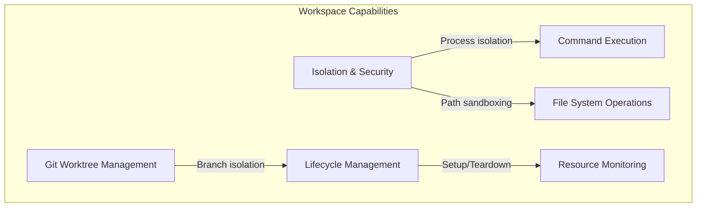
```mermaid
graph TB
    subgraph "Workspace Capabilities"
        ISO[Isolation & Security]
        GIT[Git Worktree Management]
        EXE[Command Execution]
        FS[File System Operations]
        LC[Lifecycle Management]
        MON[Resource Monitoring]
    end
    
    ISO --> |"Process isolation"| EXE
    ISO --> |"Path sandboxing"| FS
    GIT --> |"Branch isolation"| LC
    LC --> |"Setup/Teardown"| MON
```

### Strategic Value
- **Complete Task Isolation**: Every task operates in its own environment
- **Concurrent Execution**: Multiple agents work simultaneously without conflicts
- **Version Control Safety**: Git worktrees prevent code conflicts
- **Resource Management**: Controlled allocation and cleanup
- **Security Boundaries**: Sandboxed execution prevents system access

## Architectural Principles

### Core Design Principles

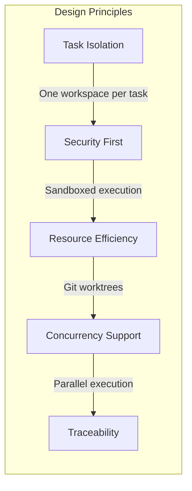
```mermaid
graph LR
    subgraph "Design Principles"
        ISO[Task Isolation]
        SEC[Security First]
        EFF[Resource Efficiency]
        CON[Concurrency Support]
        TRA[Traceability]
    end
    
    ISO --> |"One workspace per task"| SEC
    SEC --> |"Sandboxed execution"| EFF
    EFF --> |"Git worktrees"| CON
    CON --> |"Parallel execution"| TRA
```

1. **Complete Isolation**: Each task operates in a completely separate environment
2. **Security by Design**: All operations are sandboxed and validated
3. **Resource Efficiency**: Shared git objects, lazy initialization
4. **Concurrent Safety**: Multiple agents can work simultaneously
5. **Full Traceability**: All operations are logged and tracked

### Architectural Constraints

- **No Shared State**: Workspaces never share data or resources
- **Immutable Infrastructure**: Workspaces are disposable and recreatable
- **Fail-Safe Defaults**: Security restrictions enabled by default
- **Graceful Degradation**: Failures isolated to individual workspaces

## Core Architecture

### System Architecture

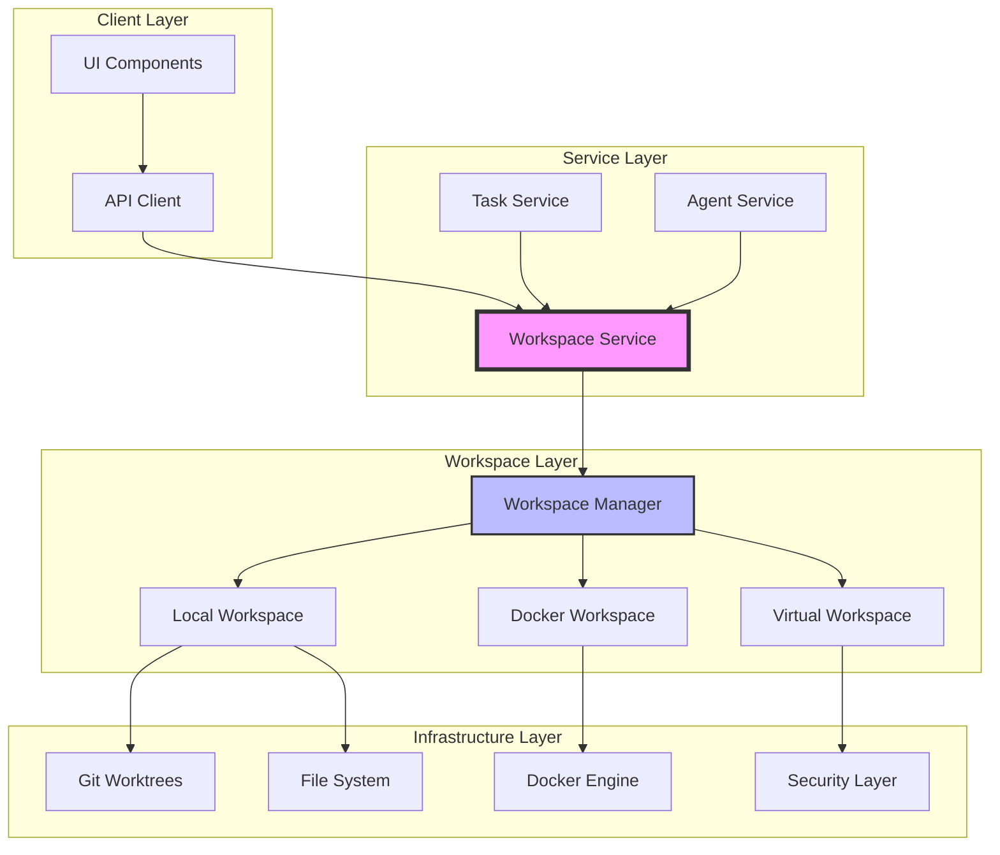
```mermaid
graph TB
    subgraph "Client Layer"
        UI[UI Components]
        API[API Client]
    end
    
    subgraph "Service Layer"
        WS[Workspace Service]
        TS[Task Service]
        AS[Agent Service]
    end
    
    subgraph "Workspace Layer"
        WM[Workspace Manager]
        LW[Local Workspace]
        DW[Docker Workspace]
        VW[Virtual Workspace]
    end
    
    subgraph "Infrastructure Layer"
        GIT[Git Worktrees]
        FS[File System]
        DOC[Docker Engine]
        SEC[Security Layer]
    end
    
    UI --> API
    API --> WS
    TS --> WS
    AS --> WS
    
    WS --> WM
    WM --> LW
    WM --> DW
    WM --> VW
    
    LW --> GIT
    LW --> FS
    DW --> DOC
    VW --> SEC
    
    style WS fill:#f9f,stroke:#333,stroke-width:4px
    style WM fill:#bbf,stroke:#333,stroke-width:2px
```

### Component Architecture

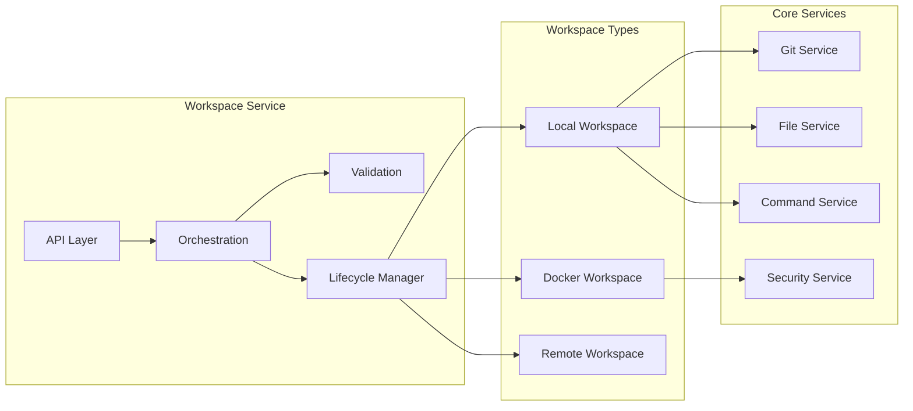
```mermaid
graph LR
    subgraph "Workspace Service"
        direction TB
        API[API Layer]
        ORCH[Orchestration]
        VAL[Validation]
        LIFE[Lifecycle Manager]
    end
    
    subgraph "Workspace Types"
        direction TB
        LOCAL[Local Workspace]
        DOCKER[Docker Workspace]
        REMOTE[Remote Workspace]
    end
    
    subgraph "Core Services"
        direction TB
        GIT[Git Service]
        FS[File Service]
        CMD[Command Service]
        SEC[Security Service]
    end
    
    API --> ORCH
    ORCH --> VAL
    ORCH --> LIFE
    
    LIFE --> LOCAL
    LIFE --> DOCKER
    LIFE --> REMOTE
    
    LOCAL --> GIT
    LOCAL --> FS
    LOCAL --> CMD
    DOCKER --> SEC
```

### Workspace Hierarchy

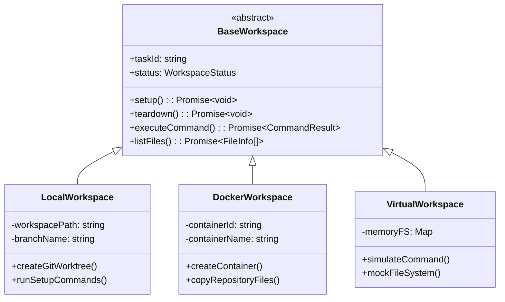
```mermaid
classDiagram
    class BaseWorkspace {
        <<abstract>>
        +taskId: string
        +status: WorkspaceStatus
        +setup(): Promise~void~
        +teardown(): Promise~void~
        +executeCommand(): Promise~CommandResult~
        +listFiles(): Promise~FileInfo[]~
    }
    
    class LocalWorkspace {
        -workspacePath: string
        -branchName: string
        +createGitWorktree()
        +runSetupCommands()
    }
    
    class DockerWorkspace {
        -containerId: string
        -containerName: string
        +createContainer()
        +copyRepositoryFiles()
    }
    
    class VirtualWorkspace {
        -memoryFS: Map
        +simulateCommand()
        +mockFileSystem()
    }
    
    BaseWorkspace <|-- LocalWorkspace
    BaseWorkspace <|-- DockerWorkspace
    BaseWorkspace <|-- VirtualWorkspace
```

## Isolation Architecture

### Git Worktree Isolation

```mermaid
graph TB
    subgraph "Main Repository"
        MAIN[Main Branch]
        OBJ[Git Objects]
        REF[References]
    end
    
    subgraph "Workspace A"
        WA[Worktree A]
        BA[Branch: task-123]
        FA[Files & Changes]
    end
    
    subgraph "Workspace B"
        WB[Worktree B]
        BB[Branch: task-456]
        FB[Files & Changes]
    end
    
    subgraph "Workspace C"
        WC[Worktree C]
        BC[Branch: task-789]
        FC[Files & Changes]
    end
    
    OBJ --> |"Shared objects"| WA
    OBJ --> |"Shared objects"| WB
    OBJ --> |"Shared objects"| WC
    
    WA --> BA
    WB --> BB
    WC --> BC
    
    style OBJ fill:#f96,stroke:#333,stroke-width:2px
```

**Key Benefits:**
- **Shared Git Objects**: Efficient disk usage through object sharing
- **Independent Branches**: Each workspace has its own branch
- **Parallel Development**: Multiple agents work without conflicts
- **Clean Separation**: Changes isolated until explicitly merged

### Docker Container Isolation

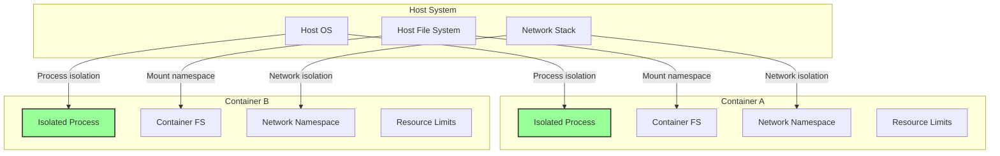
```mermaid
graph TB
    subgraph "Host System"
        HS[Host OS]
        HF[Host File System]
        NET[Network Stack]
    end
    
    subgraph "Container A"
        CA[Isolated Process]
        FA[Container FS]
        NA[Network Namespace]
        RA[Resource Limits]
    end
    
    subgraph "Container B"
        CB[Isolated Process]
        FB[Container FS]
        NB[Network Namespace]
        RB[Resource Limits]
    end
    
    HS --> |"Process isolation"| CA
    HS --> |"Process isolation"| CB
    HF --> |"Mount namespace"| FA
    HF --> |"Mount namespace"| FB
    NET --> |"Network isolation"| NA
    NET --> |"Network isolation"| NB
    
    style CA fill:#9f9,stroke:#333,stroke-width:2px
    style CB fill:#9f9,stroke:#333,stroke-width:2px
```

**Container Benefits:**
- **Complete Process Isolation**: No cross-task interference
- **Resource Limits**: CPU, memory, and I/O constraints
- **Network Isolation**: Separate network namespaces
- **File System Isolation**: Independent file systems

### Process Isolation Strategy

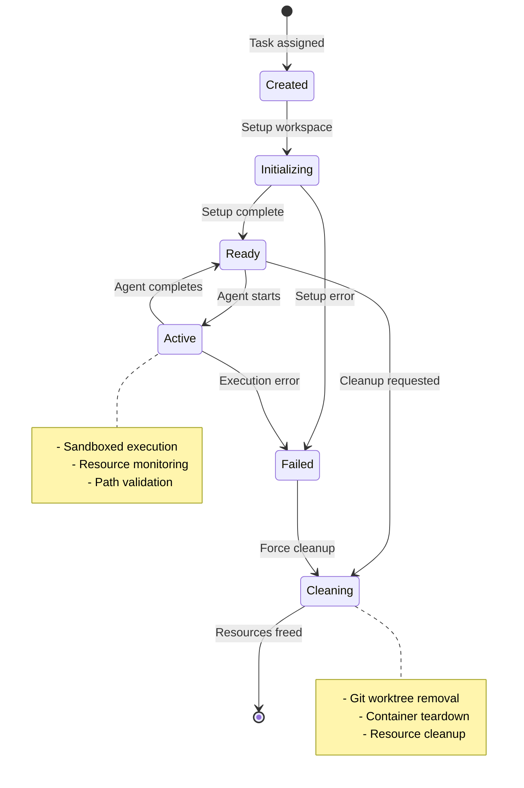
```mermaid
stateDiagram-v2
    [*] --> Created: Task assigned
    Created --> Initializing: Setup workspace
    Initializing --> Ready: Setup complete
    Initializing --> Failed: Setup error
    Ready --> Active: Agent starts
    Active --> Ready: Agent completes
    Active --> Failed: Execution error
    Ready --> Cleaning: Cleanup requested
    Failed --> Cleaning: Force cleanup
    Cleaning --> [*]: Resources freed
    
    note right of Active
        - Sandboxed execution
        - Resource monitoring
        - Path validation
    end note
    
    note right of Cleaning
        - Git worktree removal
        - Container teardown
        - Resource cleanup
    end note
```

## Lifecycle Management

### Workspace Creation Flow

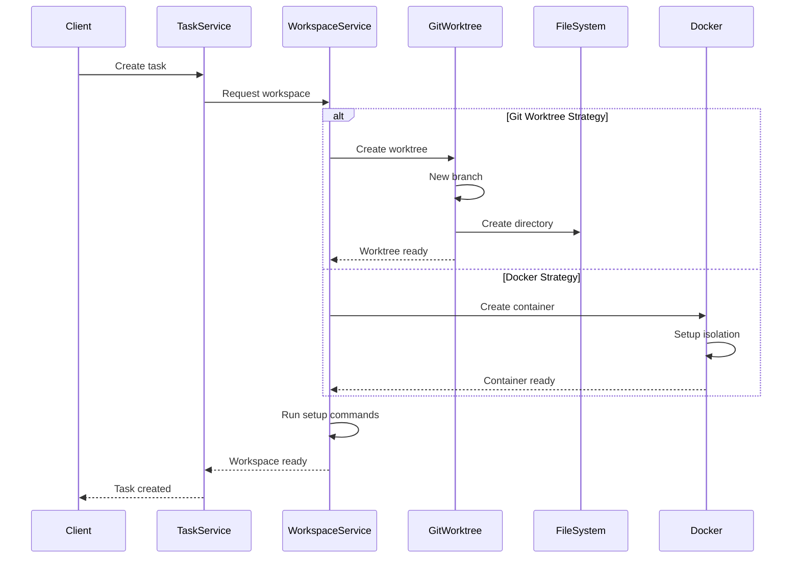
```mermaid
sequenceDiagram
    participant Client
    participant TaskService
    participant WorkspaceService
    participant GitWorktree
    participant FileSystem
    
    Client->>TaskService: Create task
    TaskService->>WorkspaceService: Request workspace
    
    alt Git Worktree Strategy
        WorkspaceService->>GitWorktree: Create worktree
        GitWorktree->>GitWorktree: New branch
        GitWorktree->>FileSystem: Create directory
        GitWorktree-->>WorkspaceService: Worktree ready
    else Docker Strategy
        WorkspaceService->>Docker: Create container
        Docker->>Docker: Setup isolation
        Docker-->>WorkspaceService: Container ready
    end
    
    WorkspaceService->>WorkspaceService: Run setup commands
    WorkspaceService-->>TaskService: Workspace ready
    TaskService-->>Client: Task created
```

### Workspace Teardown Flow

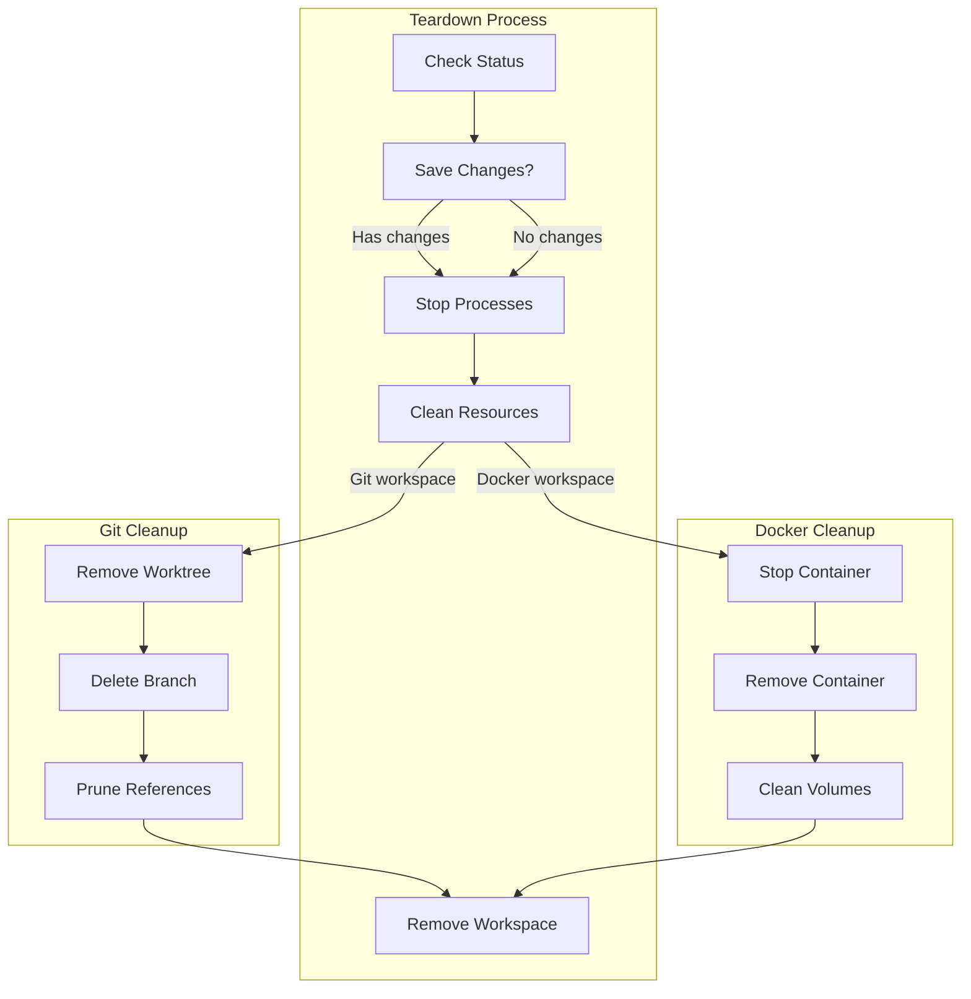
```mermaid
graph TB
    subgraph "Teardown Process"
        CHECK[Check Status]
        SAVE[Save Changes?]
        STOP[Stop Processes]
        CLEAN[Clean Resources]
        REMOVE[Remove Workspace]
    end
    
    subgraph "Git Cleanup"
        GIT1[Remove Worktree]
        GIT2[Delete Branch]
        GIT3[Prune References]
    end
    
    subgraph "Docker Cleanup"
        DOC1[Stop Container]
        DOC2[Remove Container]
        DOC3[Clean Volumes]
    end
    
    CHECK --> SAVE
    SAVE --> |"Has changes"| STOP
    SAVE --> |"No changes"| STOP
    STOP --> CLEAN
    CLEAN --> |"Git workspace"| GIT1
    CLEAN --> |"Docker workspace"| DOC1
    GIT1 --> GIT2
    GIT2 --> GIT3
    DOC1 --> DOC2
    DOC2 --> DOC3
    GIT3 --> REMOVE
    DOC3 --> REMOVE
```

## Security Architecture

### Path Sandboxing

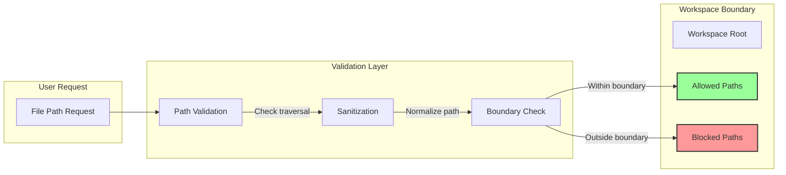
```mermaid
graph LR
    subgraph "User Request"
        REQ[File Path Request]
    end
    
    subgraph "Validation Layer"
        VAL1[Path Validation]
        VAL2[Sanitization]
        VAL3[Boundary Check]
    end
    
    subgraph "Workspace Boundary"
        WS[Workspace Root]
        ALLOWED[Allowed Paths]
        BLOCKED[Blocked Paths]
    end
    
    REQ --> VAL1
    VAL1 --> |"Check traversal"| VAL2
    VAL2 --> |"Normalize path"| VAL3
    VAL3 --> |"Within boundary"| ALLOWED
    VAL3 --> |"Outside boundary"| BLOCKED
    
    style BLOCKED fill:#f99,stroke:#333,stroke-width:2px
    style ALLOWED fill:#9f9,stroke:#333,stroke-width:2px
```

### Command Execution Security

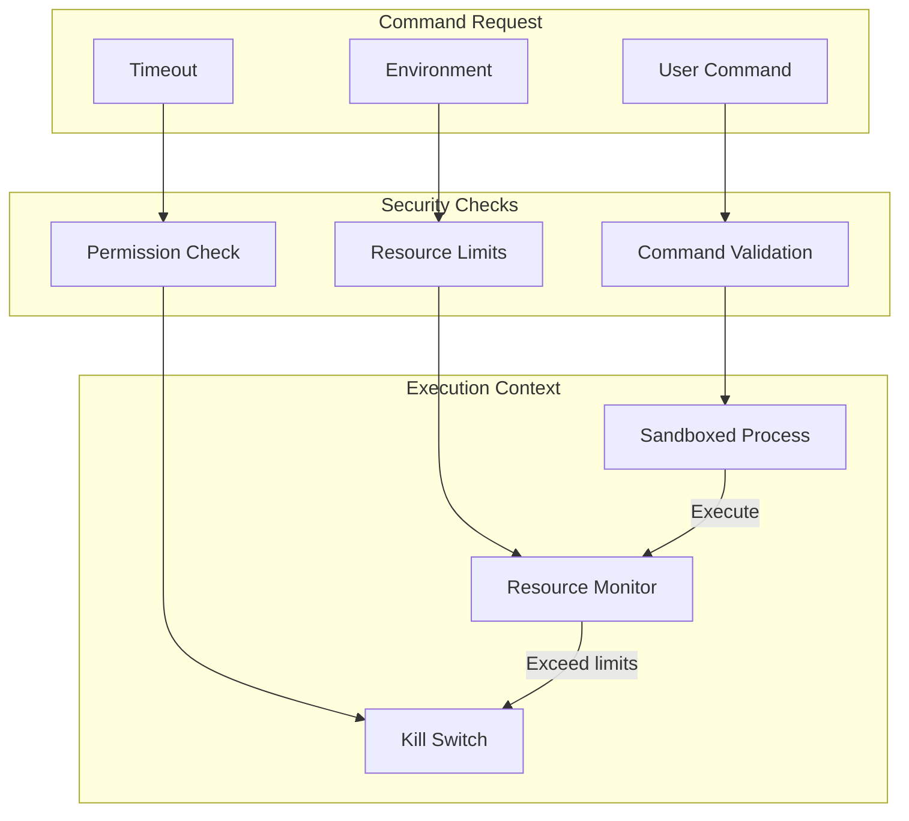
```mermaid
graph TB
    subgraph "Command Request"
        CMD[User Command]
        ENV[Environment]
        TIMEOUT[Timeout]
    end
    
    subgraph "Security Checks"
        CHECK1[Command Validation]
        CHECK2[Resource Limits]
        CHECK3[Permission Check]
    end
    
    subgraph "Execution Context"
        SANDBOX[Sandboxed Process]
        MONITOR[Resource Monitor]
        KILL[Kill Switch]
    end
    
    CMD --> CHECK1
    ENV --> CHECK2
    TIMEOUT --> CHECK3
    
    CHECK1 --> SANDBOX
    CHECK2 --> MONITOR
    CHECK3 --> KILL
    
    SANDBOX --> |"Execute"| MONITOR
    MONITOR --> |"Exceed limits"| KILL
```

### Multi-Layer Security

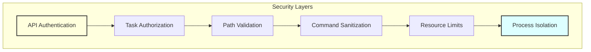
```mermaid
graph TB
    subgraph "Security Layers"
        L1[API Authentication]
        L2[Task Authorization]
        L3[Path Validation]
        L4[Command Sanitization]
        L5[Resource Limits]
        L6[Process Isolation]
    end
    
    L1 --> L2
    L2 --> L3
    L3 --> L4
    L4 --> L5
    L5 --> L6
    
    style L1 fill:#ffd,stroke:#333,stroke-width:2px
    style L6 fill:#dff,stroke:#333,stroke-width:2px
```

## Integration Architecture

### Service Integration

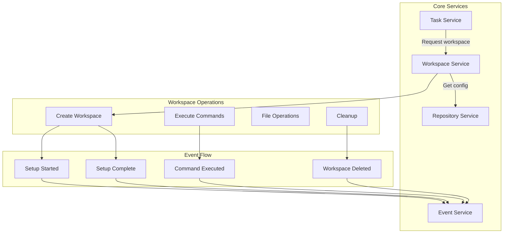
```mermaid
graph TB
    subgraph "Core Services"
        WS[Workspace Service]
        TS[Task Service]
        RS[Repository Service]
        ES[Event Service]
    end
    
    subgraph "Workspace Operations"
        CREATE[Create Workspace]
        EXEC[Execute Commands]
        FILES[File Operations]
        CLEAN[Cleanup]
    end
    
    subgraph "Event Flow"
        E1[Setup Started]
        E2[Setup Complete]
        E3[Command Executed]
        E4[Workspace Deleted]
    end
    
    TS --> |"Request workspace"| WS
    WS --> |"Get config"| RS
    WS --> CREATE
    CREATE --> E1
    CREATE --> E2
    EXEC --> E3
    CLEAN --> E4
    
    E1 --> ES
    E2 --> ES
    E3 --> ES
    E4 --> ES
```

### API Integration Pattern

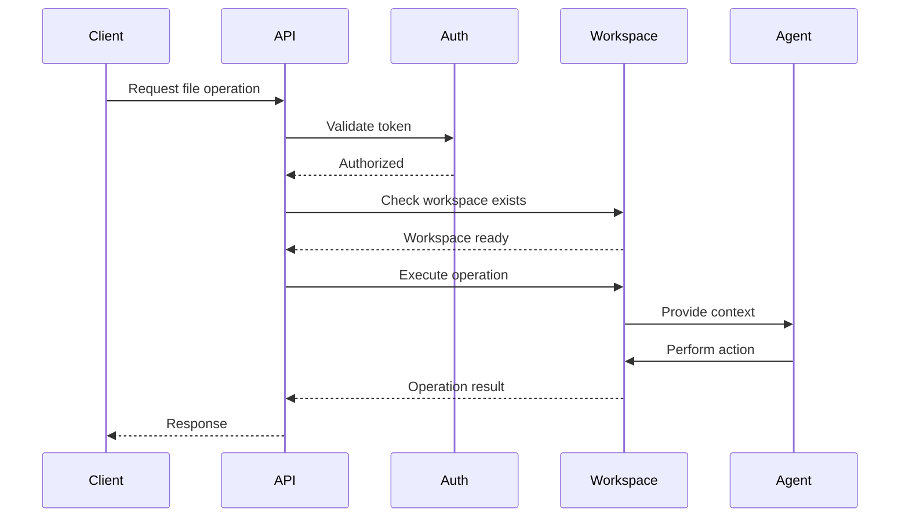
```mermaid
sequenceDiagram
    participant Client
    participant API
    participant Auth
    participant Workspace
    participant Agent
    
    Client->>API: Request file operation
    API->>Auth: Validate token
    Auth-->>API: Authorized
    API->>Workspace: Check workspace exists
    Workspace-->>API: Workspace ready
    API->>Workspace: Execute operation
    Workspace->>Agent: Provide context
    Agent->>Workspace: Perform action
    Workspace-->>API: Operation result
    API-->>Client: Response
```

## Performance & Scalability

### Resource Management

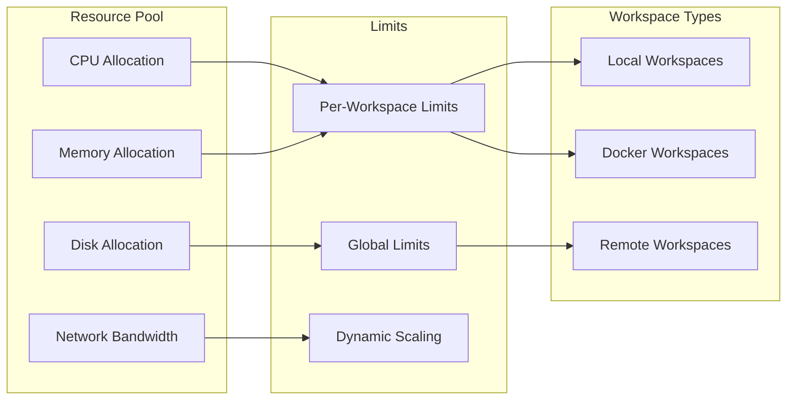
```mermaid
graph LR
    subgraph "Resource Pool"
        CPU[CPU Allocation]
        MEM[Memory Allocation]
        DISK[Disk Allocation]
        NET[Network Bandwidth]
    end
    
    subgraph "Workspace Types"
        LOCAL[Local Workspaces]
        DOCKER[Docker Workspaces]
        REMOTE[Remote Workspaces]
    end
    
    subgraph "Limits"
        L1[Per-Workspace Limits]
        L2[Global Limits]
        L3[Dynamic Scaling]
    end
    
    CPU --> L1
    MEM --> L1
    DISK --> L2
    NET --> L3
    
    L1 --> LOCAL
    L1 --> DOCKER
    L2 --> REMOTE
```

### Scaling Strategy

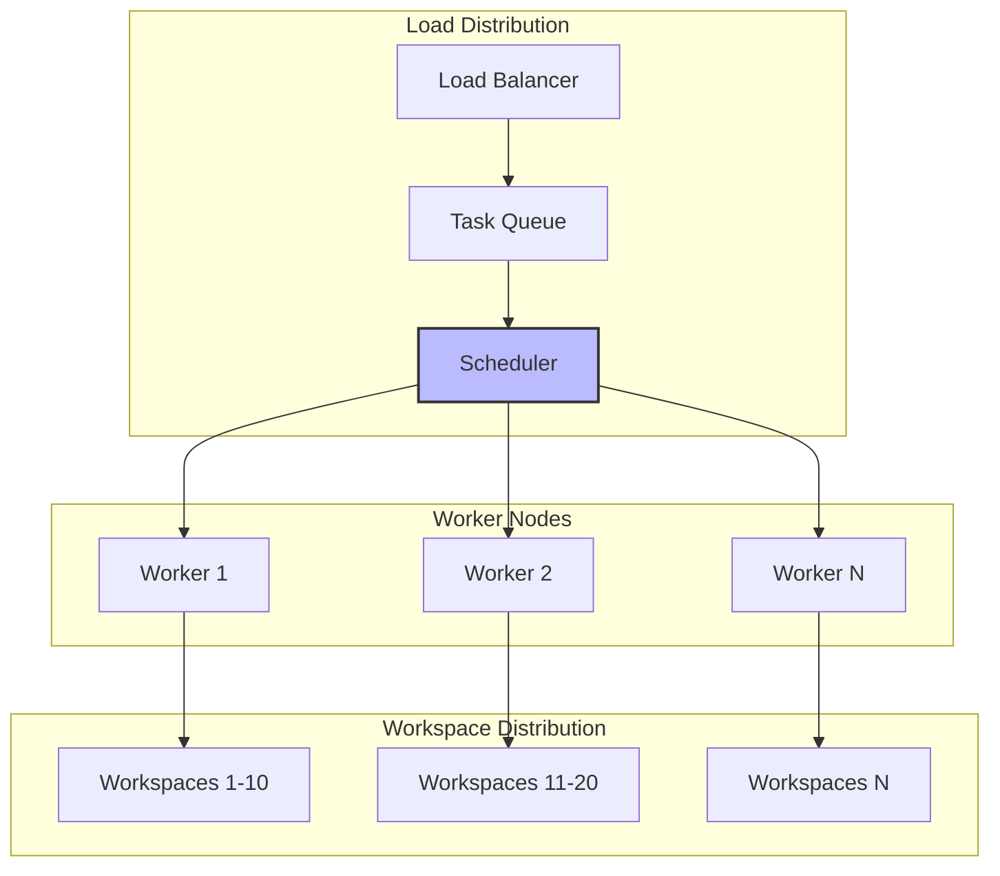
```mermaid
graph TB
    subgraph "Load Distribution"
        LB[Load Balancer]
        Q[Task Queue]
        SCHED[Scheduler]
    end
    
    subgraph "Worker Nodes"
        W1[Worker 1]
        W2[Worker 2]
        W3[Worker N]
    end
    
    subgraph "Workspace Distribution"
        WS1[Workspaces 1-10]
        WS2[Workspaces 11-20]
        WS3[Workspaces N]
    end
    
    LB --> Q
    Q --> SCHED
    SCHED --> W1
    SCHED --> W2
    SCHED --> W3
    
    W1 --> WS1
    W2 --> WS2
    W3 --> WS3
    
    style SCHED fill:#bbf,stroke:#333,stroke-width:2px
```

## Monitoring & Observability

### Workspace Metrics

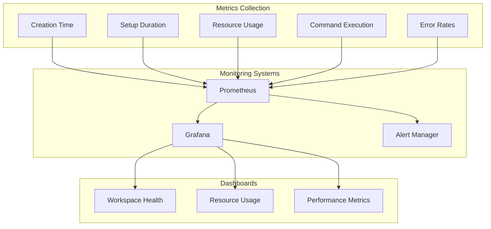
```mermaid
graph TB
    subgraph "Metrics Collection"
        M1[Creation Time]
        M2[Setup Duration]
        M3[Resource Usage]
        M4[Command Execution]
        M5[Error Rates]
    end
    
    subgraph "Monitoring Systems"
        PROM[Prometheus]
        GRAF[Grafana]
        ALERT[Alert Manager]
    end
    
    subgraph "Dashboards"
        D1[Workspace Health]
        D2[Resource Usage]
        D3[Performance Metrics]
    end
    
    M1 --> PROM
    M2 --> PROM
    M3 --> PROM
    M4 --> PROM
    M5 --> PROM
    
    PROM --> GRAF
    PROM --> ALERT
    
    GRAF --> D1
    GRAF --> D2
    GRAF --> D3
```

### Event Tracking

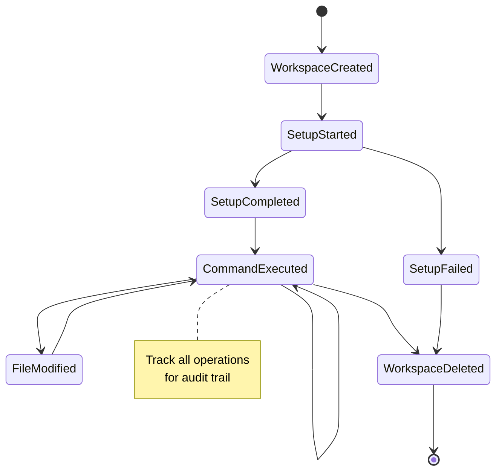
```mermaid
stateDiagram-v2
    [*] --> WorkspaceCreated
    WorkspaceCreated --> SetupStarted
    SetupStarted --> SetupCompleted
    SetupStarted --> SetupFailed
    SetupCompleted --> CommandExecuted
    CommandExecuted --> CommandExecuted
    CommandExecuted --> FileModified
    FileModified --> CommandExecuted
    CommandExecuted --> WorkspaceDeleted
    SetupFailed --> WorkspaceDeleted
    WorkspaceDeleted --> [*]
    
    note right of CommandExecuted
        Track all operations
        for audit trail
    end note
```

## Best Practices

### Workspace Lifecycle Best Practices

1. **Lazy Initialization**
   - Create workspaces only when needed
   - Defer expensive operations
   - Cache setup results

2. **Resource Cleanup**
   - Always clean up on task completion
   - Implement timeout-based cleanup
   - Monitor orphaned workspaces

3. **Error Handling**
   - Graceful degradation on failures
   - Automatic retry with backoff
   - Clear error reporting

4. **Security First**
   - Validate all inputs
   - Sandbox all operations
   - Audit all actions

### Performance Optimization

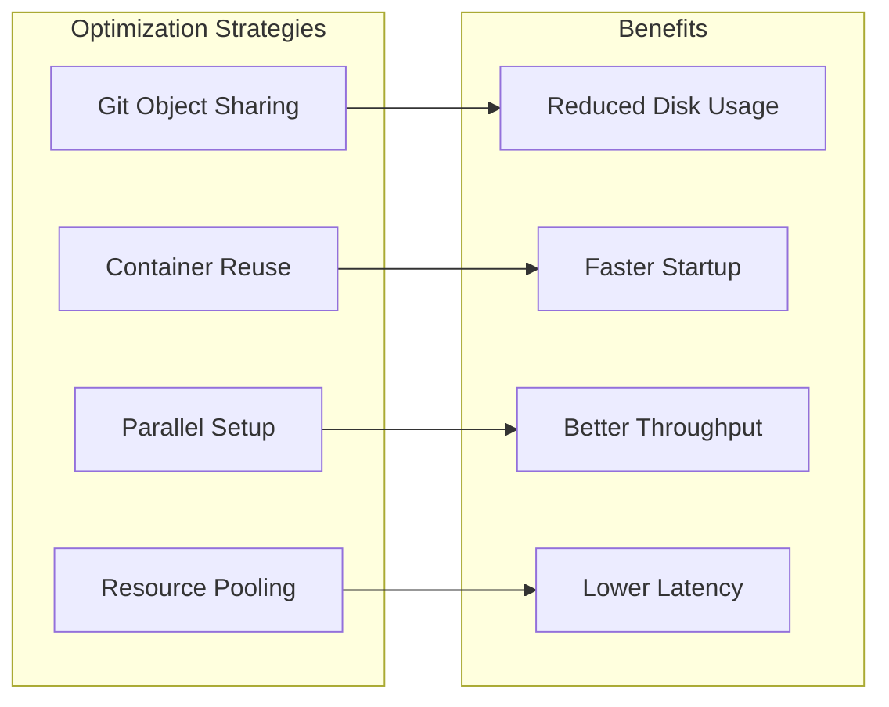
```mermaid
graph LR
    subgraph "Optimization Strategies"
        OPT1[Git Object Sharing]
        OPT2[Container Reuse]
        OPT3[Parallel Setup]
        OPT4[Resource Pooling]
    end
    
    subgraph "Benefits"
        B1[Reduced Disk Usage]
        B2[Faster Startup]
        B3[Better Throughput]
        B4[Lower Latency]
    end
    
    OPT1 --> B1
    OPT2 --> B2
    OPT3 --> B3
    OPT4 --> B4
```

### Security Guidelines

- **Never expose host paths** outside workspace boundaries
- **Validate all file paths** against directory traversal
- **Limit command execution** with timeouts and resource limits
- **Audit all operations** for security analysis
- **Use containers** for untrusted code execution
- **Implement defense in depth** with multiple security layers

## Related Documentation

- [Architecture Overview](../architecture-overview.md)
- [Repository Management](./repositories.md)
- [Agent Architecture](./agents.md)
- [Task Management](./tasks.md)
- [Event Architecture](./events.md)
- [Security Patterns](../patterns/security.md)